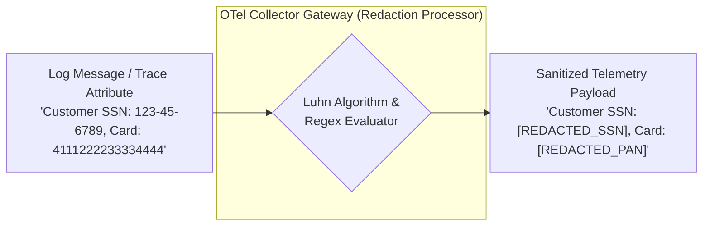

# OpenTelemetry Governance, Cardinality & PII Masking

## 1. Executive Summary
Without strong organizational governance, OpenTelemetry deployments degrade into noisy, expensive, and non-compliant data swamps. This document establishes the enterprise policies governing OpenTelemetry semantic standards, cardinality ceilings, attribute redaction, and compliance validation.

---

## 2. Telemetry Cardinality Governance

High-cardinality values are identifiers with millions of potential unique combinations. Injecting high-cardinality values into **metric labels** causes exponential time-series explosion in Prometheus/M3.

```
Metric: http_requests_total
Safe Dimensions (Bounded):
  - method (GET, POST, PUT, DELETE) -> 4 series
  - status_code (200, 400, 404, 500) -> 4 series
  - Total Series = 4 * 4 = 16 time series (Nominal)

Dangerous Dimensions (Unbounded!):
  - user_id (5,000,000 customers)
  - Total Series = 4 * 4 * 5,000,000 = 80,000,000 time series!
  -> Out of memory crash / $200,000 cloud bill!
```

### The Cardinality Separation Rule
* **Metric Labels**: Strictly low-cardinality enums ($< 100$ unique combinations per label).
* **Span Attributes**: Medium-to-high cardinality (User ID, Order ID, Device Model) is acceptable on distributed trace spans because traces are indexed as discrete search documents rather than persistent time series.
* **Structured Logs**: Arbitrary cardinality acceptable.

---

## 3. Automated PII Redaction & Data Protection

Compliance standards (GDPR, PCI-DSS, HIPAA) mandate that sensitive data must never appear in unencrypted telemetry streams.



### Automated Redaction Patterns
1. **Client-Side Masking**: Logging frameworks must intercept parameters annotated with `@SensitiveData` before formatting log strings.
2. **Gateway-Level Regex Defense**: The regional OTel Collector Gateway enforces regex redaction filters for:
   - Credit Card PANs (Visa, Mastercard, Amex via Luhn regex validation).
   - Social Security Numbers (`\b\d{3}-\d{2}-\d{4}\b`).
   - Authorization Bearer tokens (`Bearer [A-Za-z0-9\-\._~\+\/]+=*`).
