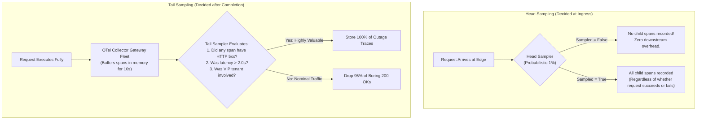
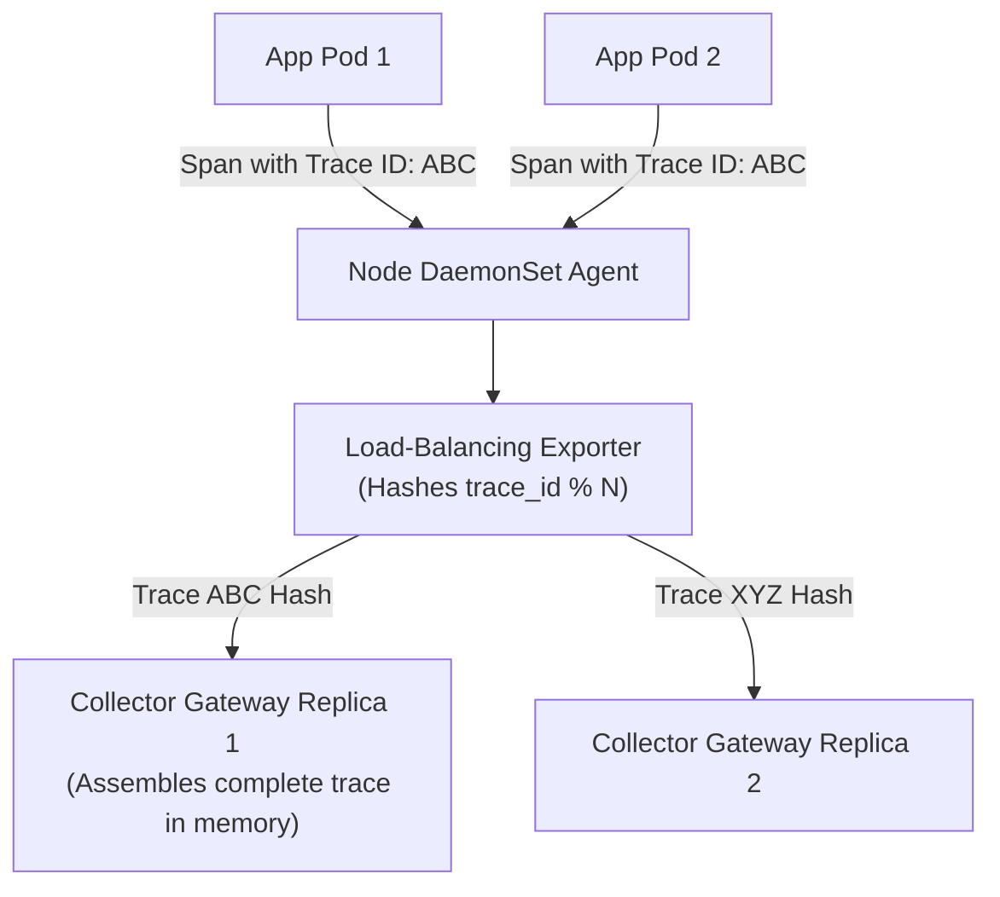

# Distributed Trace Sampling Strategies & Economics

## 1. Executive Summary
In high-throughput enterprise systems processing tens of thousands of requests per second (e.g., 50,000 QPS), **sampling 100% of traces is economically and operationally non-viable**. 50,000 QPS with an average of 10 spans per trace generates 500,000 spans per second, totaling 43.2 billion spans per day. The network egress, collector memory, and storage backend bills would exceed the cost of running the primary application.

Trace sampling is the architectural discipline of selecting the most statistically significant and diagnostically valuable traces while discarding redundant nominal traffic.

---

## 2. Head Sampling vs Tail Sampling

---

## 3. Comparative Analysis of Sampling Approaches

| Strategy | Decision Point | Ingestion Cost | Diagnostic Quality | Trade-offs & Operational Realities |
| :--- | :--- | :--- | :--- | :--- |
| **Head Probabilistic (e.g., 1%)** | Root Span (Edge Gateway) | **Lowest** (Drops spans before generation). | **Poor** (Misses 99% of rare production errors). | A 1-in-a-million race condition will almost certainly be dropped by head sampling. |
| **Head Rate-Limiting** | Root Span | **Bounded** (e.g., max 100 traces/sec). | Moderate. | Protects backend storage from traffic spikes, but drops traces under Black Friday load. |
| **Tail Sampling (Error & Latency)** | Gateway Collector Fleet | Moderate (Collectors require memory buffer). | **Optimal** (Captures 100% of errors and slow requests). | Collectors must be stateful or use trace-ID hash routing to ensure all spans of a trace land on the same collector replica. |
| **Adaptive / Dynamic Sampling** | Runtime Controller | Balanced. | High. | Automatically throttles sampling percentage during heavy load; increases sampling during quiet periods. |

---

## 4. Tail Sampling Routing Architecture

To execute tail sampling across a clustered fleet of OpenTelemetry Collector gateways, **all spans belonging to the same `trace_id` must arrive at the exact same Collector gateway replica**.

### Memory Sizing Formula for Tail Sampling Collectors
$$\text{Memory Required} = \text{Spans/sec} \times \text{Average Span Size (Bytes)} \times \text{Decision Wait Window (Seconds)} \times 1.5$$

For an enterprise processing 50,000 spans/sec, with an average span size of 1.2 KB and a 10-second `decision_wait`:
$$\text{Memory} = 50,000 \times 1,200 \times 10 \times 1.5 \approx 900 \text{ MB of active buffer RAM}$$
This is well within standard Kubernetes pod limits (e.g., 4 GB container limit).
