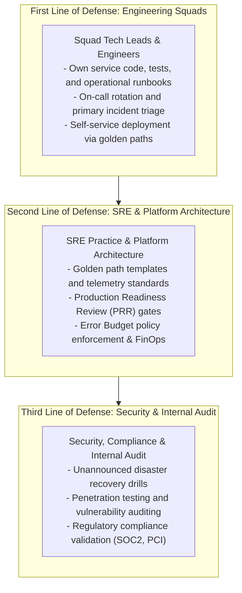

# Enterprise Operational Governance Framework

## 1. Executive Summary
Operational governance defines the policies, accountabilities, auditing mechanisms, and organizational interfaces that maintain architectural integrity, security compliance, and platform reliability across multi-team enterprises.

---

## 2. The Three Lines of Operational Defense

---

## 3. Operational Governance Review Rhythms

| Cadence | Forum / Ceremony | Key Deliverables & Decisions |
| :--- | :--- | :--- |
| **Weekly** | **SRE Operational Review** | Review weekly SEV-1/SEV-2 incidents, lingering post-mortem action items, and services nearing Error Budget exhaustion. |
| **Bi-Weekly** | **Production Readiness Reviews** | Formal gating review for services migrating from staging to production. Audits checklists and telemetry golden signals. |
| **Monthly** | **FinOps Telemetry Review** | Analyze cloud infrastructure and observability bills. Identify high-cardinality label offenders and idle resources. |
| **Quarterly** | **Architecture Review Board (ARB)** | Review foundational ADRs, approve technology deprecations, and align platform roadmap with enterprise strategy. |

---

## 4. Non-Negotiable Operational Guardrails
1. **No Service Without an Owner**: Every deployed artifact in production must have an active `owner_team` metadata tag and corresponding PagerDuty escalation rota.
2. **Mandatory Post-Mortems**: Any incident impacting customer SLOs must yield a blameless post-mortem document within 72 hours.
3. **Automated Enforcement Over Bureaucracy**: Policies must be codified into OPA Rego rules, CI linters, and Prometheus alert configurations rather than manual PDF sign-offs.
