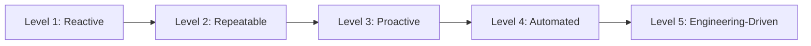

# Operational Architecture & SRE Maturity Model

## Executive Summary

This maturity model benchmarks an organization's operational and site reliability practices across five developmental stages.

---

## 1. Five Operational Maturity Levels

### Level 1: Reactive (Firefighting)
- **Characteristics**: Outages discovered by angry customers; no SLOs defined; manual SSH deployments; hero-based ad-hoc firefighting; tribal knowledge without runbooks.

### Level 2: Repeatable (Documented)
- **Characteristics**: Centralized monitoring (basic CPU/memory alerts); documented wiki runbooks; standard on-call rotations; manual post-incident write-ups.

### Level 3: Proactive (SRE Foundations)
- **Characteristics**: SLOs and Error Budgets defined for Tier-1 services; Distributed tracing active; Blameless post-mortem culture; automated canary deployments; alert noise reduced by 50%.

### Level 4: Automated (Self-Healing)
- **Characteristics**: Multi-window SLO burn-rate alerting; automated rollback on canary failure; automated pod and node healing; disaster recovery game days executed quarterly in staging.

### Level 5: Engineering-Driven (Continuous Resilience)
- **Characteristics**: Error budget exhaustion automatically freezes risky feature releases; Chaos engineering executed continuously in production; Self-healing distributed cells; Toil strictly $< 20\%$ of engineering time.
