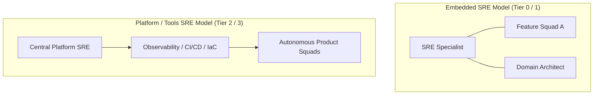

# Operational Architecture & Enterprise Operating Models

## 1. Executive Summary & Architectural Intent

An enterprise architecture that does not account for day-2 operations is an incomplete design. **Operational Architecture** defines the structural relationship between technical components and the human, operational, and organizational capabilities required to operate them reliably, securely, and economically.

This document establishes the enterprise operating models, service criticality tiering, operational-level agreements (OLAs), and production handover gates governing mission-critical platforms.

---

## 2. Enterprise Service Criticality Tiering

Enterprises must classify services according to their business impact to allocate operational rigor, SRE staffing, and disaster recovery investments objectively:

| Tier | Classification | Downtime Financial Impact | Target Availability | RTO / RPO | On-Call Model |
| :--- | :--- | :--- | :--- | :--- | :--- |
| **Tier 0** | Core Financial / Revenue Gateway | > $500,000 / hour | 99.99% (52.6 min/yr) | RTO < 1 min, RPO = 0 | 24/7 Dedicated SRE + Follow-the-Sun |
| **Tier 1** | Customer Facing / Core Business | $100k - $500k / hour | 99.95% (4.38 hr/yr) | RTO < 15 min, RPO < 1 min | 24/7 Rotational Primary + Secondary |
| **Tier 2** | Internal Business Operations | $10k - $100k / hour | 99.9% (8.76 hr/yr) | RTO < 1 hour, RPO < 15 min | 12/5 Business Hours + Escalation |
| **Tier 3** | Analytics / Batch / Reporting | < $10,000 / hour | 99.0% (87.6 hr/yr) | RTO < 24 hours, RPO < 4 hours | Best-Effort Business Hours |

---

## 3. Operating Model Archetypes



### 3.1 Embedded SRE Pods (High-Touch)
* **Context**: Applied to Tier-0 and Tier-1 systems (e.g., Core Banking, Payment Switches, Global Auth).
* **Composition**: 2–3 dedicated SREs embedded directly inside the product squad.
* **Responsibilities**: Joint backlog ownership, architectural PRR enforcement, automated chaos testing, and primary on-call rotation participation.

### 3.2 Centralized Platform SRE (Consultative & Golden Paths)
* **Context**: Applied across Tier-2 and Tier-3 microservices across the broader engineering organization.
* **Composition**: Central SRE team building automated guardrails, reusable Terraform modules, and observability tooling.
* **Responsibilities**: Golden path infrastructure, Prometheus/OpenTelemetry platforms, and post-incident review facilitation.

---

## 4. Operational-Level Agreements (OLAs) & Service Contracts

While Service Level Agreements (SLAs) govern commitments to external customers, **Operational Level Agreements (OLAs)** govern the internal operational commitments between architecture, platform teams, database administrators, and network operations:

```
[Customer] <---- (SLA: 99.95%) ----> [Payments Gateway API]
                                             |
                                   (OLA: P99 < 15ms, 99.99%)
                                             v
                                  [Central Database Cluster]
```

### OLA Requirements Matrix
1. **Network Infrastructure**: P99 transit latency < 2ms intra-region, failover path convergence < 500ms.
2. **Identity & Token Introspection**: Local JWKS validation (0 network calls); centralized token revocation OLA < 5000ms.
3. **Storage & Database Failover**: Automated database failover completed within 30 seconds with 0 committed data loss (RPO=0).

---

## 5. Production Handover & Operational Verification Gates

Before any service is promoted to production or undergoes major architectural refactoring, it must complete the 5-point Operational Verification Gate:

1. **Deterministic Runbooks**: Step-by-step diagnostic and remediation runbooks published in the central repository with verified shell commands.
2. **Automated Alerting**: Alert rules configured using multi-window multi-burn-rate algorithms; zero threshold-only CPU alerts.
3. **Escalation Path**: PagerDuty/Opsgenie rotation verified with secondary and management escalation paths tested via simulated page.
4. **Log & Telemetry Hygiene**: Structured JSON logs conforming to the OpenTelemetry schema with correlation IDs propagating across all outbound RPCs.
5. **Backout & Rollback Plan**: Automated one-click canary rollback tested in staging with zero schema degradation.
