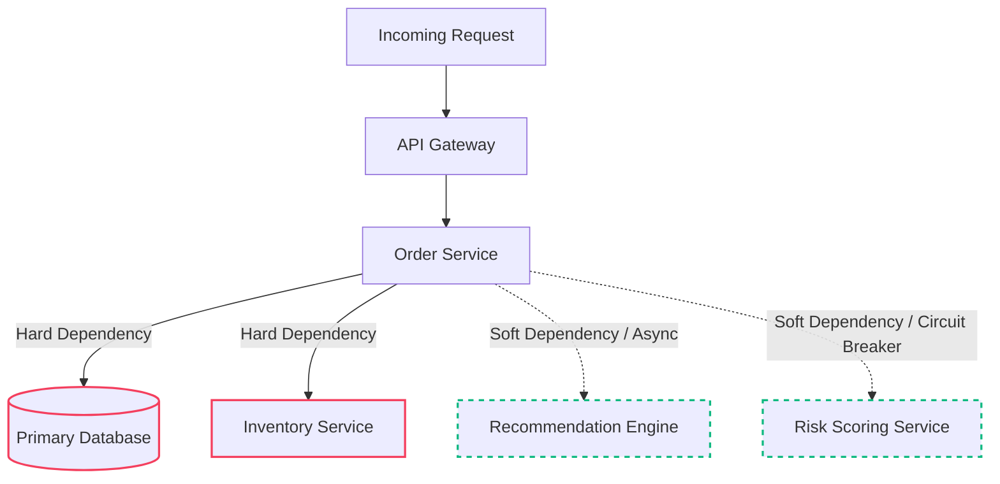
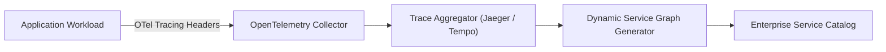

# Service Dependency Mapping & Blast Radius Architecture

## 1. Executive Summary & Core Intent

In a modern enterprise composed of hundreds of microservices, third-party SaaS integrations, and cloud primitives, outages rarely originate in the component that exhibits the failure. Outages originate from **unmapped, transitive dependencies** propagating latency, connection pool exhaustion, and cascading resource starvation.

This document establishes the architecture for automated service dependency mapping, dependency classification (Hard vs. Soft), and blast radius containment boundaries.

---

## 2. Dependency Taxonomy: Hard vs. Soft Dependencies

Every architectural dependency must be explicitly categorized to enforce appropriate resilience patterns:

### 2.1 Hard Dependencies (Must Fail if Unavailable)
* **Definition**: A downstream component without which the calling service cannot fundamentally fulfill its core business contract.
* **Architectural Treatment**:
  * Strict timeout policies (P99 + 3 standard deviations, capped at 2000ms).
  * Fast-fail mechanisms; no unbounded retries.
  * Direct participation in availability calculations ($Availability_{total} = Availability_A \times Availability_B$).

### 2.2 Soft Dependencies (Degrade Gracefully)
* **Definition**: A downstream component providing supplemental, non-critical functionality (e.g., product recommendations, real-time analytics, non-blocking fraud score enrichment).
* **Architectural Treatment**:
  * Circuit breakers with fallback responses (e.g., cached default recommendations, offline heuristic fallback).
  * Asynchronous decoupling via message queues or event streams (Kafka/RabbitMQ).
  * Zero impact on caller availability score.

---

## 3. Automated Dependency Discovery Architecture

Static dependency documentation becomes obsolete the moment it is written. Enterprise dependency topologies must be generated dynamically from runtime telemetry:

### 3.1 Trace-Driven Discovery
* Distributed tracing spans (W3C `traceparent`) capture explicit RPC call graphs.
* Aggregation engines compute directional edge matrices: source to target with latency and error rates.

### 3.2 eBPF Network Mesh Discovery
* Kernel-level eBPF probes (e.g., Cilium Hubble) observe socket connections across pods.
* Discovers uninstrumented legacy databases, third-party external APIs, and uncataloged sidecar proxies.

---

## 4. Blast Radius Containment & Tier-0 Failure Domains

To prevent localized incidents from turning into enterprise-wide outages, architects must enforce architectural blast radius containment boundaries:

### 4.1 Cellular Architecture Partitioning
* Partition workloads into completely autonomous, independent "Cells" or "Swimlanes."
* A failure within Cell 1 (e.g., EU Customer Shard) cannot starve compute, database connections, or cache memory in Cell 2 (US Customer Shard).

### 4.2 Bulkheading at the Transport Layer
* **Thread Pool Isolation**: Dedicated connection pools per downstream dependency. If the payment gateway stalls, order inquiry worker threads remain unimpaired.
* **Kubernetes Node Group Separation**: Isolate critical Tier-0 workloads onto dedicated node groups with taints and tolerations, avoiding noisy-neighbor resource starvation.

---

## 5. Architectural Verification & Dependency Auditing

Architecture Review Boards (ARB) must verify the following invariants for every service dependency:

1. **No Circular Dependencies**: Cyclic topologies ($A \to B \to C \to A$) are strictly prohibited at compile and runtime.
2. **Circuit Breaker Coverage**: 100% of external and cross-service HTTP/gRPC dependencies must be guarded by an active circuit breaker with a verified fallback.
3. **Timeout Ceiling**: No outbound network timeout may exceed 5,000ms unless explicitly exempted for asynchronous batch workloads.
4. **Chaos Verification**: Systems must demonstrate automated survival during monthly Chaos Engineering game days where downstream dependencies are injected with 100% packet drop and 5,000ms latency.
