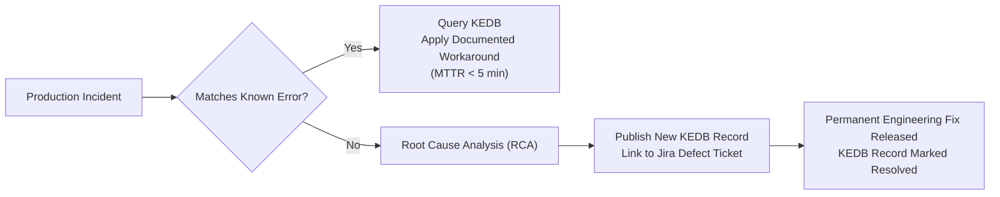

# Known Error Database (KEDB) Architecture

## 1. Executive Summary
A Known Error Database (KEDB) is an operational repository containing records of identified underlying technical defects that have known root causes and documented temporary workarounds, pending permanent engineering remediation.

---

## 2. KEDB Lifecycle & Incident Triaging Flow



---

## 3. Canonical KEDB Record Schema

Every KEDB record must adhere to the following structured format:

```yaml
kedb_id: "KEDB-2026-084"
service_affected: "payment-authorization-service"
symptom: "HTTP 504 Gateway Timeout during rapid token refresh"
root_cause: "Connection pool deadlock in Redis cluster driver under TLS renegotiation"
temporary_workaround: |
  1. Trigger rolling restart of payment pods:
     kubectl rollout restart deployment/payment-auth -n payments
  2. Scale Redis replica pool by 2 instances:
     aws elasticache modify-replication-group --replication-group-id pay-redis --apply-immediately
permanent_fix_tracking: "JIRA-PLAT-4592"
target_release_version: "v3.14.0"
date_logged: "2026-04-12"
owner: "payments-core-squad"
status: "ACTIVE_WORKAROUND"
```

---

## 4. Best Practices for KEDB Maintenance
- **Integration with Alert Payloads**: When an alert fires for a known defect, Alertmanager automatically injects the corresponding KEDB link into the PagerDuty notification.
- **Bi-Weekly Pruning**: KEDB records older than 90 days are reviewed by the Problem Manager to ensure engineering squads do not treat temporary workarounds as permanent architectures.
