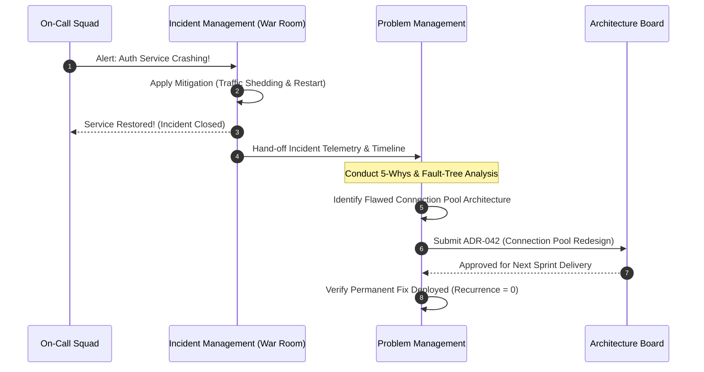

# Problem Management vs. Incident Management

## 1. Executive Summary
Conflating Incident Management with Problem Management is one of the most common operational failure modes in enterprise software. While **Incident Management** is focused exclusively on immediate restoration of service, **Problem Management** is focused on identifying and eradicating the underlying root causes to prevent future recurrence.

---

## 2. Comparative Matrix

| Dimension | Incident Management | Problem Management |
| :--- | :--- | :--- |
| **Primary Mission** | Restore service availability as fast as possible. | Identify root cause and eliminate recurring failure modes. |
| **Operational Metric** | Mean Time to Mitigate (MTTR). | Incident recurrence rate; Problem resolution velocity. |
| **Temporal Horizon** | Real-time (Minutes to Hours). | Structural (Days, Weeks, Sprints). |
| **Key Activities** | Traffic shifting, pod restarts, rollback, workarounds. | Deep-dive telemetry analysis, code refactoring, architecture redesign. |
| **Primary Artifact** | Incident War Room, Statuspage notification. | Root Cause Analysis (RCA), KEDB record, Architecture Decision Record (ADR). |
| **Target Role** | Incident Commander, On-Call Engineers. | Problem Manager, Principal Architect, SRE Practice Lead. |

---

## 3. Hand-off Workflow

