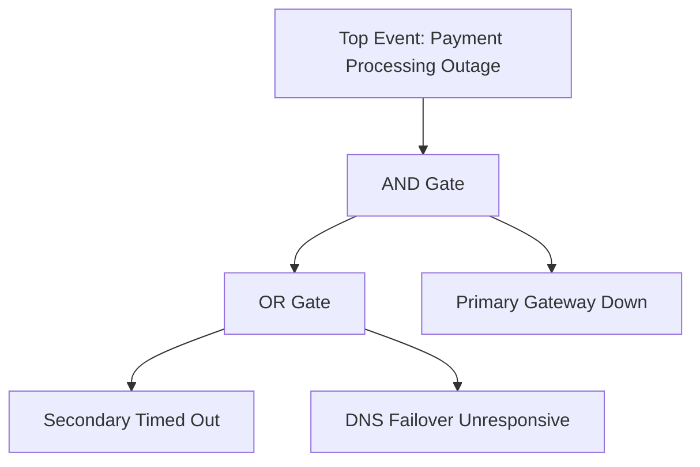

# Enterprise Root Cause Analysis (RCA) Methodologies

## 1. Executive Summary
A comprehensive guide to rigorous, blameless Root Cause Analysis (RCA) techniques used by enterprise architects and SREs to investigate complex multi-system failures.

---

## 2. Core RCA Methodologies

### 1. The 5-Whys Method
Repeatedly asking "Why?" to drill down from high-level surface symptoms to underlying architectural and cultural root causes.

```text
Symptom: Payment API returned 500 Internal Server Error to 40,000 customers.
1. Why? The database connection pool was completely exhausted.
2. Why? Queries on the `accounts` table took 4,500ms instead of 4ms.
3. Why? A table scan occurred because the index on `customer_uuid` was dropped.
4. Why? A database migration script dropped the index during deployment.
5. Why? The migration script was not tested against production-like query volumes in staging.
ROOT CAUSE: Staging CI/CD pipeline lacks automated query plan (EXPLAIN) linting for migration PRs.
```

---

### 2. Fault Tree Analysis (FTA)
A top-down, deductive failure analysis using Boolean logic gates to decompose complex multi-system outages.



---

### 3. Ishikawa (Fishbone) Diagramming
Decomposing complex failures across six architectural categories: **People, Process, Software, Infrastructure, Telemetry, and External Vendors**.

---

## 3. The Blameless Post-Mortem Standard
Root cause investigations must remain strictly blameless. Human error is the **starting point** of an investigation, never the conclusion:
- **Flawed Framing**: "Developer pushed a bad SQL query."
- **Architectural Framing**: "Our CI/CD delivery pipeline lacked automated EXPLAIN plan verification to catch un-indexed table scans before production promotion."
