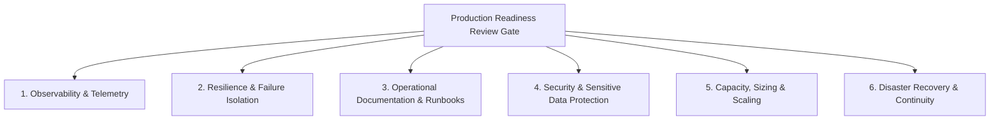

# Production Readiness Review (PRR) Architectural Framework

## 1. Executive Summary
A software artifact that passes functional integration tests is not necessarily ready to survive the hostile realities of an enterprise production environment. The **Production Readiness Review (PRR)** is an architectural gate ensuring that every service meets standardized requirements across **Observability, Reliability, Security, Operability, Capacity, and Disaster Recovery** before receiving live user traffic.

---

## 2. The 6 Dimensions of Enterprise Production Readiness



---

## 3. The Comprehensive PRR Verification Matrix

| Dimension | Mandatory Architectural Requirements | Verification Mechanism | Status Gate |
| :--- | :--- | :--- | :--- |
| **1. Observability** | - OpenTelemetry SDK integrated with W3C context propagation.<br>- Structured JSON logging with `trace_id` and `span_id` correlation.<br>- RED metrics emitted (Rate, Errors, Duration).<br>- Availability & Latency SLIs defined; SLO approved by product owner.<br>- Multi-window burn-rate alerts configured in AlertManager. | Telemetry test verification in staging; Datadog/Grafana trace inspection. | **Hard Blocker** |
| **2. Resilience** | - Timeouts configured on all egress network calls ($\le 1,500\text{ms}$).<br>- Exponential backoff with full jitter on retries; max 3 attempts.<br>- Circuit breakers configured on all non-essential downstream calls.<br>- Thread pools and connection pools sized with fast-fail timeouts.<br>- Graceful degradation fallbacks implemented. | Chaos Engineering automated fault injection in staging. | **Hard Blocker** |
| **3. Operability** | - Standardized operational runbook completed for every alert condition.<br>- Liveness, readiness, and startup health probes configured correctly.<br>- Service onboarded to dynamic service catalog with clear squad ownership.<br>- Minimum 6 engineers onboarded to on-call rotation. | Synthetic probe verification; on-call mock page drill. | **Hard Blocker** |
| **4. Security** | - All secrets stored in external secret manager (Vault / Cloud KMS).<br>- Automated PII/PAN data masking verified in logging pipelines.<br>- TLS 1.3 enforced on all ingress and egress connections.<br>- Service runs as unprivileged non-root user in container.<br>- Static code analysis (SAST) and container vulnerability scans clean. | Automated CI/CD security gate; Grype/Trivy container scan. | **Hard Blocker** |
| **5. Capacity** | - Peak traffic load test executed at $2\times$ projected maximum volume.<br>- Horizontal Pod Autoscaler (HPA) configured with CPU/memory targets.<br>- Database queries analyzed for missing indices and execution plans.<br>- Maximum memory limits set on container specs (`resources.limits`). | Locust / k6 load test reports signed off by performance lead. | **Soft Blocker** (Requires Plan) |
| **6. Disaster Recovery** | - Stateless workloads distributed across minimum 3 Availability Zones.<br>- Stateful databases configured with automated multi-AZ replication.<br>- Backup restore drill successfully executed within target RTO/RPO.<br>- Graceful shutdown hooks handle `SIGTERM` within 30 seconds. | Staging zone evacuation exercise; automated restore script. | **Hard Blocker** |

---

## 4. The PRR Lifecycle & Governance Workflow

```
[Sprint Planning: New Service Proposed]
                 │
                 ▼
[Design Phase: Architectural Pre-Mortem & PRR Checklist Provisioned]
                 │
                 ▼
[Development Phase: Squad Implements Code + Telemetry + Runbooks]
                 │
                 ▼
[Staging Deployment: Automated PRR Telemetry Verification]
  - Verifies: Metrics, logs, traces, health checks, and chaos resiliency.
                 │
                 ▼
[PRR Formal Review: SRE Guild Sign-Off]
  - If All Hard Blockers PASS: Promoted to Production with 1% Canary.
  - If Any Hard Blocker FAILS: Deployment blocked; remediation sprint scheduled.
```
