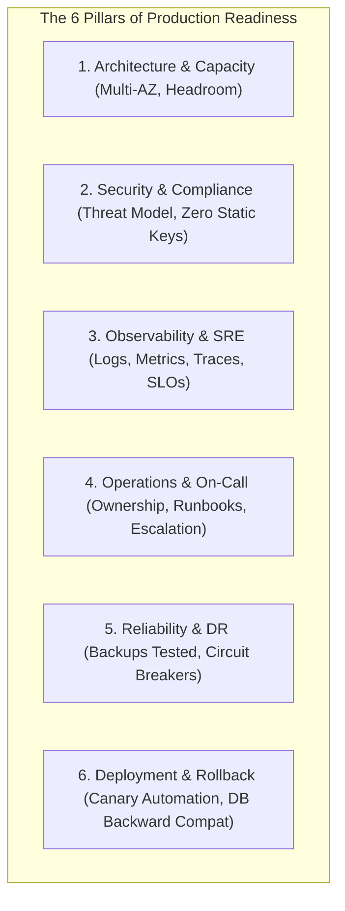

# Enterprise Production Readiness Framework

## Executive Summary

```mermaid
flowchart TD
    subgraph Dimensions ["The 6 Pillars of Production Readiness"]
        D1["1. Architecture & Capacity (Multi-AZ, Headroom)"]
        D2["2. Security & Compliance (Threat Model, Zero Static Keys)"]
        D3["3. Observability & SRE (Logs, Metrics, Traces, SLOs)"]
        D4["4. Operations & On-Call (Ownership, Runbooks, Escalation)"]
        D5["5. Reliability & DR (Backups Tested, Circuit Breakers)"]
        D6["6. Deployment & Rollback (Canary Automation, DB Backward Compat)"]
    end
```
