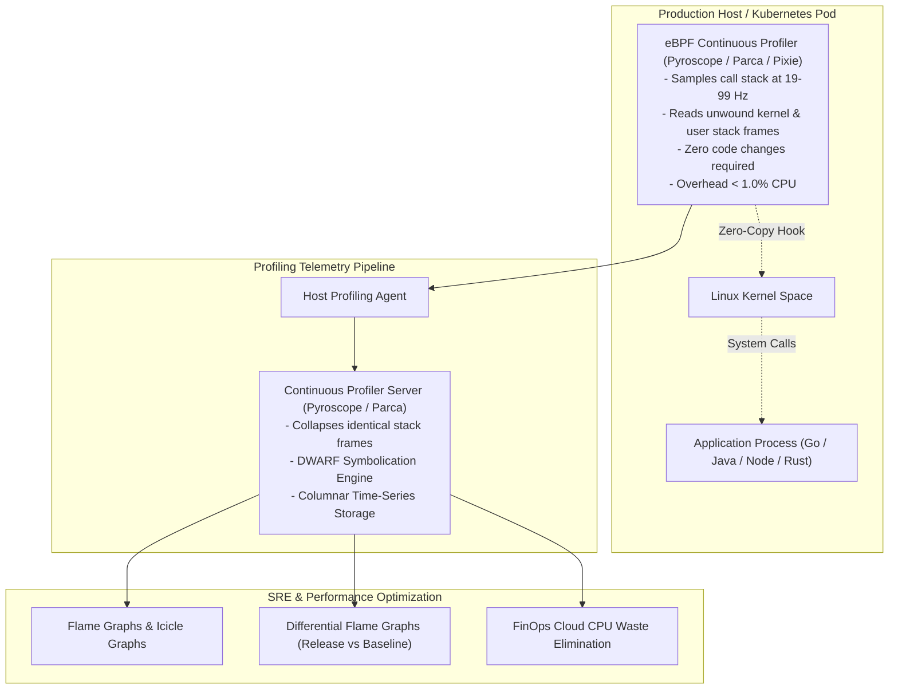

# Continuous Profiling Architecture & Runtime Analysis

## Executive Summary

Metrics show *when* a service is slow; distributed traces identify *which* service or database call is slow; continuous profiling shows **which line of code, memory allocation, or lock contention** is burning CPU cycles inside that service.

Historically, profiling was a disruptive, manual exercise executed only in development environments. **Continuous Profiling** (powered by eBPF and low-overhead runtime sampling) operates 24/7/365 in live production environments with $< 1\%$ CPU and memory overhead, capturing flame graphs of every thread across the entire enterprise fleet.

---

## Directory Index

| Document | Architectural Focus |
| :--- | :--- |
| **[`continuous-profiling.md`](continuous-profiling.md)** | Continuous profiling fundamentals: eBPF sampling, pprof, Pyroscope, Parca, and low-overhead runtimes. |
| **[`flame-graphs.md`](flame-graphs.md)** | Reading Flame and Icicle graphs: horizontal width as sample time, stack hierarchy, and differential analysis. |
| **[`cpu-profiling.md`](cpu-profiling.md)** | CPU profiling: On-CPU execution vs Off-CPU blocking, kernel vs user space, and thread scheduling states. |
| **[`memory-profiling.md`](memory-profiling.md)** | Heap and memory profiling: Allocations vs In-Use bytes, Garbage Collection churn, and memory leak detection. |
| **[`io-profiling.md`](io-profiling.md)** | Block I/O and network profiling: eBPF tracepoints for system calls (`epoll`, `read`, `write`, `fsync`). |
| **[`anti-patterns.md`](anti-patterns.md)** | 12 Lethal profiling anti-patterns (profiling only in dev, un-symbolicated binaries, ignoring off-CPU time). |
| **[`checklists/profiling-architecture-checklist.md`](checklists/profiling-architecture-checklist.md)** | 25-Point practical audit checklist for enterprise continuous profiling architecture and FinOps optimization. |
