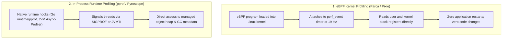

# Continuous Profiling Fundamentals: eBPF, pprof & Architecture

## 1. Executive Summary
Traditional snapshots (like Java thread dumps or manual pprof pulls) are reactive: by the time an engineer logs in to capture a dump, the CPU spike has passed. Continuous profiling captures a perpetual, historical record of code execution across all nodes.

Powered by modern **extended Berkeley Packet Filter (eBPF)** probes and runtime hooks, continuous profilers achieve **deterministic production safety** with $< 1\%$ resource overhead.

---

## 2. eBPF vs Runtime Agent Profiling

| Architectural Dimension | eBPF Kernel Profiling (Parca / Pixie) | In-Process Agent (Pyroscope / Async-Profiler) |
| :--- | :--- | :--- |
| **Application Modification** | **Zero** (Completely transparent) | Minor (Sidecar or library dependency) |
| **Languages Supported** | Compiled (C, C++, Rust, Go) + JIT with symbol maps | Language-specific (Java JVM, Go, Python, Ruby, .NET) |
| **Kernel vs User Visibility** | **Full visibility** into both kernel space and user space | User-space runtime only |
| **Memory Allocation Detail** | Coarse page allocations | Fine-grained class names and object allocation counts |
| **CPU Overhead** | $\approx 0.3\% - 0.8\%$ | $\approx 0.5\% - 1.2\%$ |

---

## 3. The Mathematics of Low-Overhead Sampling (19 Hz)

Why do production profilers sample at **19 Hz** (19 times per second)?
- **Overhead Minimization**: Sampling at 19 Hz captures sufficient statistical density over 60 seconds (1,140 stack samples per thread) to accurately identify bottlenecks without inducing CPU cache thrashing.
- **Anti-Harmonic Sampling**: Profiling at 20 Hz, 50 Hz, or 100 Hz risks **aliasing harmonics** with periodic application loops (e.g., a timer firing exactly every 50ms). Using a prime frequency (19 Hz or 99 Hz) prevents synchronized sampling artifacts.
