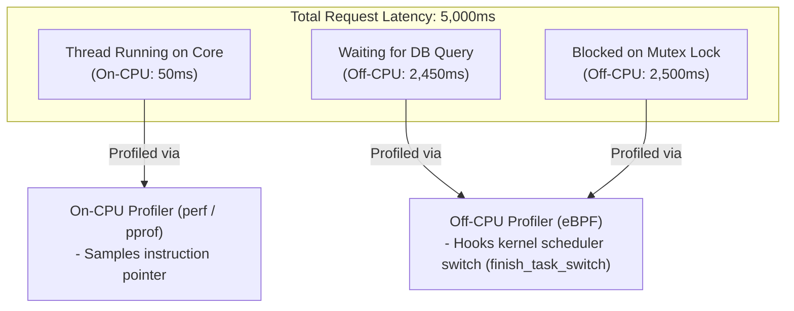

# CPU Profiling: On-CPU vs Off-CPU Architecture

## 1. Executive Summary
When an application slows down, engineers instinctively look at CPU utilization. However, a thread taking 5 seconds to process a request might only spend 50 milliseconds on the CPU; the remaining 4,950 milliseconds were spent **waiting (Off-CPU)** for a database lock, disk I/O, or a mutex.

Comprehensive profiling requires measuring both **On-CPU execution** and **Off-CPU blocking**.

---

## 2. On-CPU vs Off-CPU Execution

---

## 3. Off-CPU Profiling via eBPF Kernel Scheduler Hooks

While On-CPU profilers sample active threads, Off-CPU profilers measure **how long a thread is descheduled**:
1. When a thread context switches off a CPU core, the eBPF hook records `start_time` and the call stack that initiated the block (e.g., `pthread_mutex_lock`).
2. When the thread is scheduled back onto a CPU, the eBPF hook records `end_time`, calculates `duration = end_time - start_time`, and aggregates the off-CPU latency.
3. This reveals hidden enterprise bottlenecks that traditional CPU profilers cannot detect:
   - Database connection pool lock starvation.
   - Synchronous logging blocking on full disk queues.
   - Thread pool contention in thread-per-request web servers.
