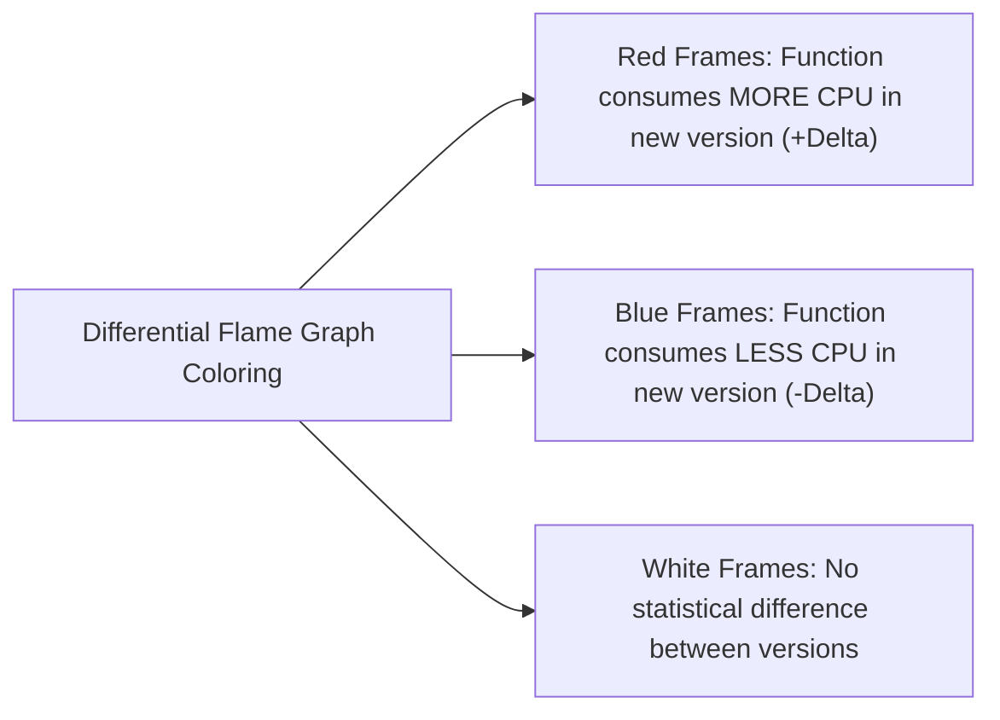

# Flame Graphs: Visualizing Runtime Performance

## 1. Executive Summary
Invented by Brendan Gregg, the **Flame Graph** is the gold standard for visualizing hierarchical profiling data. It converts millions of complex stack traces into an intuitive, interactive visual representation.

---

## 2. Anatomy of a Flame Graph

```
┌────────────────────────────────────────────────────────────────────────┐
│                        com.enterprise.JsonParser.deserialize (40%)    │
├────────────────────────────────────────────────────────────────────────┤
│                 com.enterprise.OrderController.handlePost (65%)        │
├────────────────────────────────────────────────────────────────────────┤
│          org.springframework.web.servlet.DispatcherServlet (85%)       │
├────────────────────────────────────────────────────────────────────────┤
│     org.apache.catalina.core.StandardEngineValve.invoke (98%)          │
├────────────────────────────────────────────────────────────────────────┤
│                       java.lang.Thread.run (100%)                      │
└────────────────────────────────────────────────────────────────────────┘
```

### The 4 Rules for Interpreting Flame Graphs
1. **Vertical Axis ($y$-axis)**: Represents **call stack depth**. The function at the bottom is the root (e.g., `Thread.run`), and functions stacked above it are child calls.
2. **Horizontal Axis ($x$-axis)**: Does **NOT represent time!** The horizontal order is alphabetical. The total width of a frame is proportional to the **percentage of samples** in which that function was present on the stack.
3. **The Plateau Rule**: Look for **wide flat plateaus at the top of the flame**. A wide function with nothing stacked above it is executing work directly on the CPU (e.g., string parsing, hashing, regex evaluation).
4. **Colors are Arbitrary**: In standard flame graphs, warm colors (red, orange, yellow) are chosen at random to differentiate adjacent frames. Color has no semantic meaning unless using **Differential Flame Graphs**.

---

## 3. Differential Flame Graphs (Before vs After)

When deploying a new software version, a **Differential Flame Graph** computes the delta between the baseline release and the new release:


This enables instant automated performance regression analysis during CI/CD canary rollouts.
