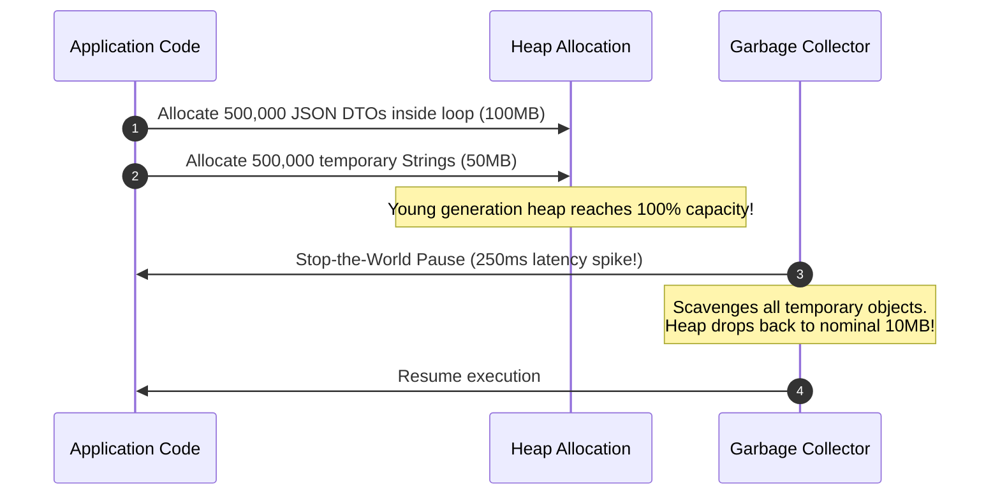

# Memory Profiling: Allocations, Heap & GC Pressure

## 1. Executive Summary
Memory problems in enterprise applications manifest in two distinct forms:
1. **Persistent Memory Leaks**: Heap memory grows monotonically until the operating system invokes the Out-Of-Memory (OOM) killer.
2. **High Allocation Churn**: Short-lived objects are allocated at gigabytes per second, forcing the Garbage Collector (JVM, Go, .NET) to execute frequent Stop-the-World pauses that destroy P99 latency.

---

## 2. Allocations vs In-Use Memory

Continuous memory profilers track two distinct dimensions:

| Memory Metric Dimension | Definition | What It Detects |
| :--- | :--- | :--- |
| **`alloc_objects` / `alloc_space`** | Total count/bytes of memory allocated since process start (including collected objects). | **GC Churn & Allocation Rate**: Pinpoints lines of code creating unnecessary temporary objects. |
| **`inuse_objects` / `inuse_space`** | Current live objects remaining in heap memory at sampling time. | **Memory Leaks**: Pinpoints caches that never evict, static collections that grow indefinitely. |

---

## 3. Detecting the "Hidden" GC Latency Bottleneck

In standard metrics, average memory appears completely healthy (constant ~10MB). However, **allocation profiling reveals that the loop is churning 150MB of garbage per request**, explaining why P99 latency is severely degraded.
