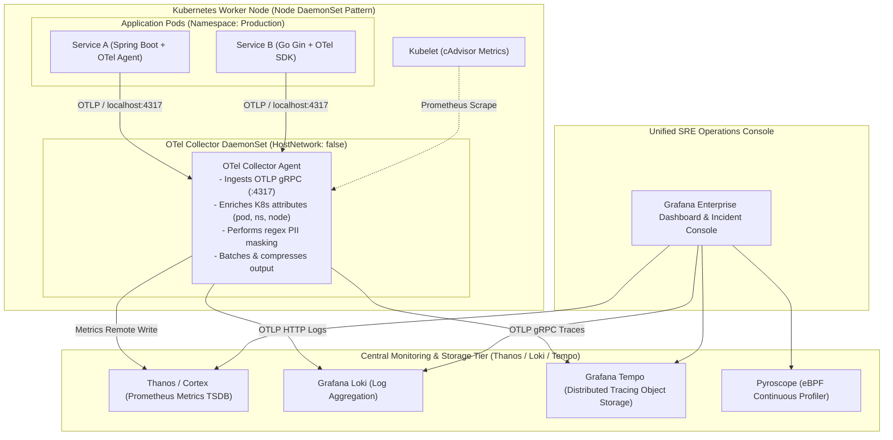

# Reference Architecture 01: Cloud-Native Kubernetes Observability

## 1. System Context & Overview
Designed for high-scale Kubernetes deployments running hundreds of microservices across multiple geographical regions. It utilizes the **OpenTelemetry (OTel) Collector DaemonSet pattern** paired with an open-source scalable storage tier (Prometheus/Thanos, Grafana Loki, Grafana Tempo, and Grafana).

See visual modeling in [`../../17-diagrams/deployment/kubernetes.md`](../../17-diagrams/deployment/kubernetes.md).

---

## 2. Architecture Diagram

---

## 3. Key Architectural Decisions
1. **Node DaemonSet vs Sidecar**: Deploying the OTel Collector as a Kubernetes **DaemonSet (1 per node)** reduces memory consumption by 85% compared to injecting sidecar containers into thousands of application pods.
2. **K8s Metadata Enrichment**: The DaemonSet collector queries the local kubelet API to automatically tag all telemetry with `k8s.pod.name`, `k8s.namespace.name`, `k8s.deployment.name`, and `k8s.node.name`.
3. **Storage Efficiency**: Metrics are federated to Thanos for long-term multi-year object storage (S3) with automated downsampling.
