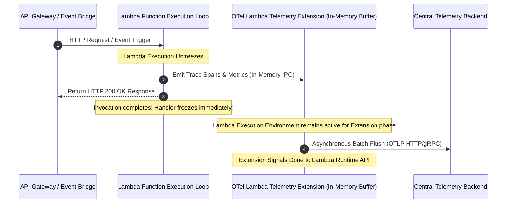

# Reference Architecture 02: Serverless & FaaS Observability

## 1. System Context & Overview
Serverless compute environments (e.g., AWS Lambda, Google Cloud Run) introduce unique architectural challenges: ephemeral execution environments, frozen execution states, extreme cold starts, and the absence of persistent host agents.

This architecture leverages the **AWS Lambda Telemetry API Extension** to deliver asynchronous, non-blocking telemetry collection without increasing invocation latency.

---

## 2. Architecture Diagram

---

## 3. Key Architectural Decisions
1. **Zero-Impact Response Latency**: The application handler flushes telemetry into the local extension memory buffer and returns the response to the user immediately. Telemetry is transmitted over the wire during the post-invocation runtime extension phase.
2. **Cold Start Instrumentation**: The OpenTelemetry layer wraps the initialization routine to record `faas.coldstart=true` and measure exact initialization duration in distributed traces.
3. **Connection Pooling**: Reusable HTTP keep-alive connections are maintained across warm invocations to eliminate repeated TLS handshake overhead.
