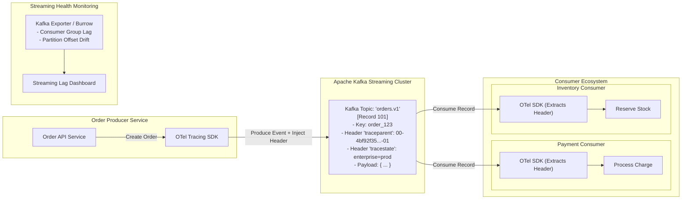

# Reference Architecture 03: Event-Driven & Streaming Observability

## 1. System Context & Overview
Asynchronous event-driven systems (built on Apache Kafka, Apache Pulsar, and Apache Flink) decouple producers and consumers across time. Standard HTTP distributed trace propagation breaks because events sit in topics for seconds, minutes, or hours before being processed.

This reference architecture implements **W3C Trace Context Record Header Propagation** and **Consumer Lag Telemetry**.

See visual modeling in [`../../17-diagrams/sequence/event-driven.md`](../../17-diagrams/sequence/event-driven.md).

---

## 2. Architecture Diagram

---

## 3. Key Architectural Decisions
1. **Trace Context in Record Headers**: The OpenTelemetry Kafka interceptor automatically serializes the active W3C `traceparent` string into binary record headers during `producer.send()`. Consumers extract the header to establish a `ChildOf` or `FollowsFrom` trace span.
2. **FollowsFrom vs ChildOf Spans**: High-latency batch consumers use OpenTelemetry `FollowsFrom` span links rather than direct child spans, ensuring long queue wait times do not distort the producer's synchronous latency metrics.
3. **Consumer Lag SLIs**: Alerting rules evaluate **Consumer Lag Time (seconds behind head)** rather than raw message count, ensuring low-volume slow partitions trigger pages before queue saturation.
