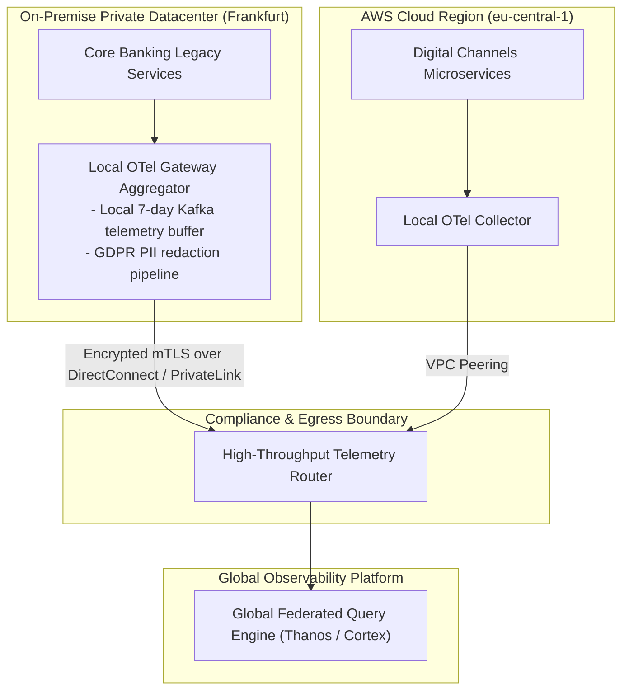

# Reference Architecture 04: Hybrid & Multi-Cloud Observability

## 1. System Context & Overview
Large global enterprises operate across on-premises legacy datacenters and multiple public cloud providers (AWS, Azure, GCP). Network partitions, cross-cloud egress costs, and data sovereignty laws (e.g., GDPR, China PIPL) make centralized telemetry ingestion challenging.

This architecture enforces **Regional Edge Pre-Aggregation** and **Sovereign Telemetry Enclaves**.

---

## 2. Architecture Diagram

---

## 3. Key Architectural Decisions
1. **Local Telemetry Buffering**: On-premises edge gateways maintain local disks and Kafka queues to buffer telemetry during WAN link degradations, ensuring zero loss of operational telemetry during network partitions.
2. **Egress Optimization**: High-frequency metric streams are downsampled locally at each regional collector before being transmitted across cloud boundaries, reducing inter-cloud data transfer costs by 80%.
3. **Unified Global Tracing**: Every service across both on-premises and multi-cloud environments adheres to the identical OpenTelemetry semantic conventions and W3C trace propagation standards.
