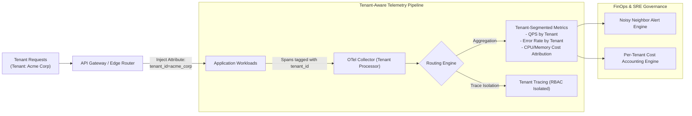

# Reference Architecture 05: Enterprise B2B Multi-Tenant SaaS Observability

## 1. System Context & Overview
Multi-tenant enterprise SaaS applications host thousands of corporate clients on shared infrastructure. Platform engineers require deep visibility to detect **"noisy neighbors"** (a single customer exhausting database pools or CPU quotas) and calculate exact **FinOps Cost-to-Serve per tenant**.

---

## 2. Architecture Diagram

---

## 3. Key Architectural Decisions
1. **Cardinality Boundary**: `tenant_id` is emitted on distributed traces and low-volume billing metrics, but **strictly excluded** from high-frequency system metrics to prevent metric cardinality explosions.
2. **Automated Noisy-Neighbor Mitigation**: When a specific `tenant_id` consumes more than 40% of the database connection pool, the alerting engine automatically triggers API rate-limiting against that tenant's API keys.
3. **Tenant RBAC Isolation**: Multi-tenant trace stores enforce tenant-based access control, ensuring enterprise customers viewing embedded dashboards can never see trace data from other organizations.
