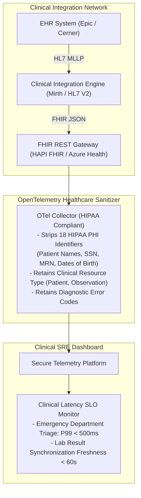

# Reference Architecture 07: Healthcare & Clinical Systems Observability

## 1. System Context & Overview
Healthcare IT architectures integrate Electronic Health Records (EHR), picture archiving systems (PACS), and clinical APIs governed by **HIPAA, HITECH, and HL7 FHIR** standards. Observability must provide deep operational tracing across clinical transactions while guaranteeing the absolute masking of **Protected Health Information (PHI)**.

---

## 2. Architecture Diagram

---

## 3. Key Architectural Decisions
1. **The 18 HIPAA Identifier Sanitization**: Collectors enforce automated regex and AST schema checks that strip all 18 HIPAA identifiers (including medical record numbers, postal addresses, and biometric identifiers) prior to log ingestion.
2. **Clinical Protocol Freshness Tracking**: In clinical environments, delayed lab results directly impact patient safety. The observability platform tracks **HL7 Message Delivery Freshness** as a Tier-1 SLI.
3. **BAA Requirements**: All third-party SaaS vendors receiving telemetry must execute a formal **Business Associate Agreement (BAA)** ensuring HIPAA compliance.
