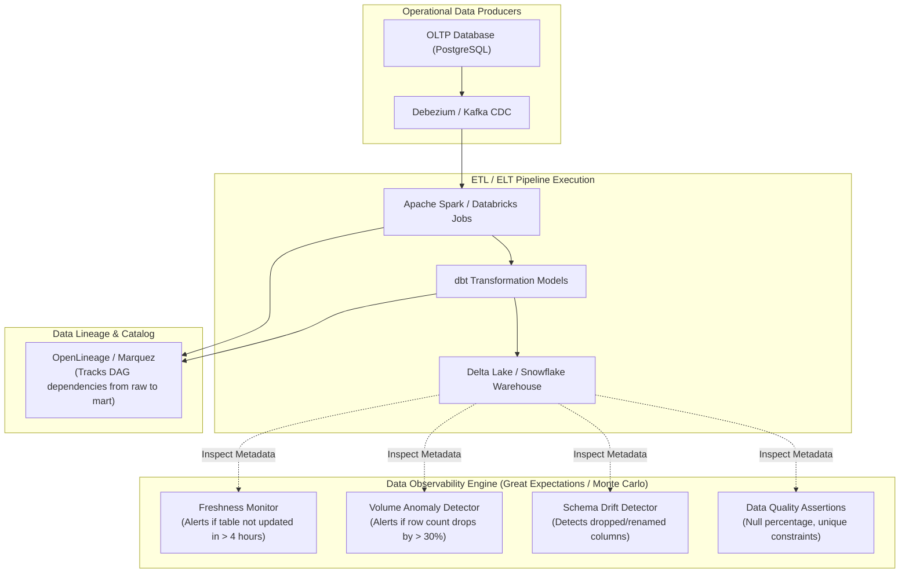

# Reference Architecture 09: Data Mesh & Analytical Lakehouse Observability

## 1. System Context & Overview
Modern data architectures rely on distributed pipelines (Apache Spark, Snowflake, Databricks, dbt) to process terabytes of analytical data. Standard application metrics (QPS and HTTP latency) are meaningless here.

**Data Observability** focuses on **Data Freshness, Volume Anomaly Detection, Schema Drift, and Lineage Tracking**.

---

## 2. Architecture Diagram

---

## 3. Key Architectural Decisions
1. **Metadata-Based Inspection**: Instead of scanning billions of raw data rows (which incurs huge Snowflake/Databricks query compute costs), freshness and volume monitors query internal database catalog metadata (`information_schema.tables`).
2. **Schema Drift Circuit Breaker**: When upstream application teams add, drop, or alter database columns, the schema monitor detects the change and pauses downstream reporting jobs before invalid data corrupts financial reports.
3. **OpenLineage Standards**: Data pipeline execution stages emit standard OpenLineage events, allowing automated end-to-end tracing from raw operational database tables to executive BI dashboards.
