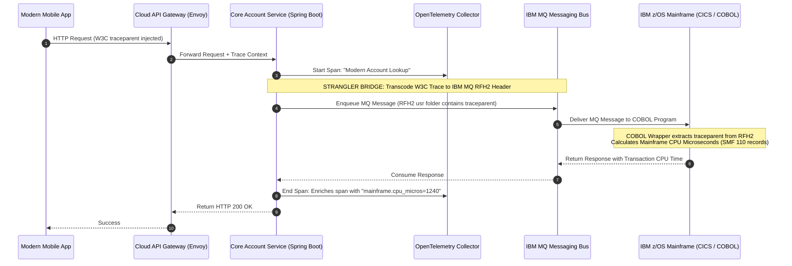

# Reference Architecture 10: Mainframe & Strangler Fig Coexistence Observability

## 1. System Context & Overview
Enterprises modernizing core legacy platforms (IBM z/OS Mainframes, CICS, IMS, and AS/400) employ the **Strangler Fig Pattern**, gradually diverting traffic from legacy systems to cloud-native microservices.

During migration (which can span 3 to 7 years), maintaining unified end-to-end distributed tracing across modern HTTP microservices and legacy IBM MQ / CICS transactions is paramount.

---

## 2. Architecture Diagram

---

## 3. Key Architectural Decisions
1. **IBM MQ RFH2 Trace Transcoding**: Modern microservices encode the 55-character W3C `traceparent` string into IBM MQ **RFH2 (Rules and Formatting Header)** folders, allowing legacy COBOL wrapper routines to read and propagate trace context.
2. **Mainframe MIPS / CPU Accounting**: Mainframe execution time is billed in MIPS (Millions of Instructions Per Second). Trace spans bridging to the mainframe capture CPU service units (via SMF 110 monitoring records) as span attributes, correlating business transactions with mainframe licensing costs.
3. **Side-by-Side Verification Observability**: Dual-write verification systems route 100% of read traffic to both the legacy mainframe and modern microservice, comparing results and emitting discrepancy metrics (`migration_payload_diff_count`).
