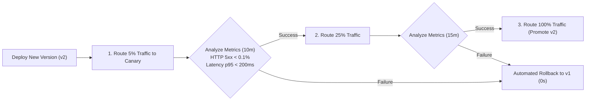

# Progressive Delivery & Automated Canary Analysis

## Executive Summary

```mermaid
flowchart LR
    Deploy["Deploy New Version (v2)"] --> Shift1["1. Route 5% Traffic to Canary"]
    Shift1 --> Analyze1{"Analyze Metrics (10m)<br/>HTTP 5xx < 0.1%<br/>Latency p95 < 200ms"}
    Analyze1 -->|Success| Shift2["2. Route 25% Traffic"]
    Analyze1 -->|Failure| Rollback["Automated Rollback to v1 (0s)"]
    Shift2 --> Analyze2{"Analyze Metrics (15m)"}
    Analyze2 -->|Success| Shift3["3. Route 100% Traffic (Promote v2)"]
    Analyze2 -->|Failure| Rollback
```
