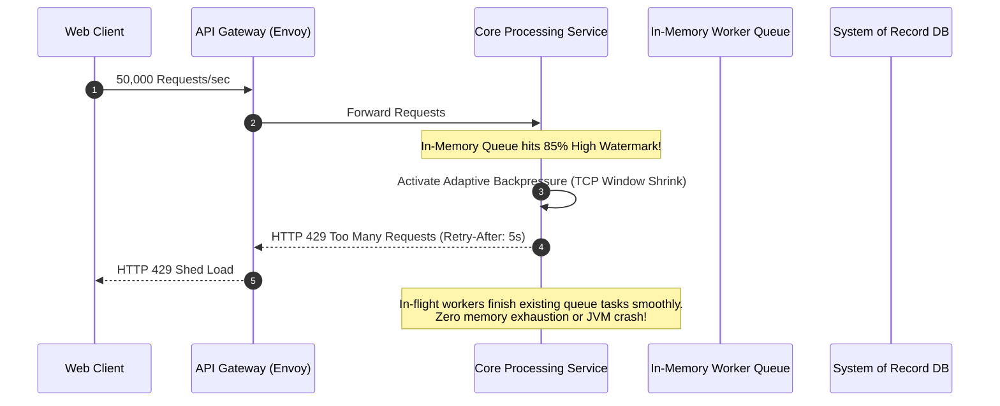

# Backpressure, Concurrency Limits & Rate Limiting

## 1. Executive Summary
Under extreme traffic surges, distributed systems fail catastrophically when unbounded request queues consume all available memory, causing cascading thread starvation. This guide details **adaptive backpressure, concurrency limits, and token-bucket rate limiting** architectures.

---

## 2. Backpressure Propagation Mechanics

---

## 3. Rate Limiting Algorithms

| Algorithm | Mechanism | Best Used For | Trade-offs |
| :--- | :--- | :--- | :--- |
| **Token Bucket** | Tokens accumulate at fixed rate up to burst capacity; requests consume tokens. | General API gateway traffic shaping; allows bursts. | Memory overhead for tracking tokens per client. |
| **Leaky Bucket** | Requests enter FIFO queue and are processed at constant outflow rate. | Egress traffic to rate-limited external third parties (e.g., Visa). | Drops bursts abruptly if buffer queue overflows. |
| **Sliding Window Log** | Timestamps of requests stored in Redis sorted set; counts requests in rolling window. | High-security financial APIs with strict quota enforcement. | High memory footprint ($O(N)$ where $N$ = request count). |
| **Adaptive Concurrency** | Dynamically measures P90 latency using Little's Law ($L = \lambda W$); shrinks queue when latency climbs. | Microservice-to-microservice internal RPC protection (e.g., Netflix Concurrency Limits). | Requires continuous runtime tuning and telemetry feedback. |

---

## 4. Key Architectural Recommendations
1. **Never Rely on Unbounded Queues**: In-memory queues must have explicit hard capacity limits. When the limit is reached, drop or reject immediately.
2. **Standardize on Rate Limit Headers**: Always return `Retry-After`, `X-RateLimit-Limit`, and `X-RateLimit-Remaining` to enable cooperative client backoff.
