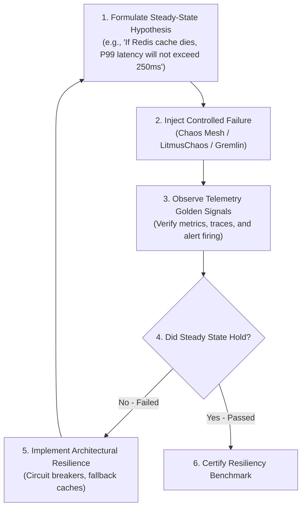

# Chaos Engineering & Resilience Game Days

## 1. Executive Summary
Chaos Engineering is the discipline of experimenting on a software system in production or staging to build confidence in the system's capability to withstand turbulent conditions. This document outlines the enterprise framework for hypothesis-driven failure injection and resilience game days.

---

## 2. The Chaos Experiment Loop

---

## 3. Common Chaos Injection Scenarios

| Attack Category | Specific Fault Injected | Expected Resilient Behavior |
| :--- | :--- | :--- |
| **Network Latency** | Add 800ms packet delay to downstream payment partner. | Circuit breaker trips in $< 2\text{ seconds}$; fallback responds gracefully. |
| **Packet Loss** | Drop 25% of packets between microservices. | gRPC retry policies handle retries with jitter; no customer 500 errors. |
| **Node Termination** | Abruptly terminate 2 Kubernetes worker nodes. | K8s scheduler redistributes pods; zero dropped HTTP connections. |
| **CPU Starvation** | Saturate 100% CPU on authentication pods. | HPA auto-scales pods; requests throttle gracefully via backpressure. |
| **DNS Blackhole** | Simulate failure of core internal DNS server. | Services use cached DNS entries; local resolvers handle fallbacks. |

---

## 4. Game Day Rules of Engagement
- **Blast Radius Containment**: Chaos attacks must start in synthetic staging, advance to canary pods in production, and only then touch active customer traffic.
- **Immediate Dead-Man Switch**: An engineer must hold an active emergency kill switch capable of halting all chaos injection in $< 500\text{ms}$.
- **Observability Must Be Pre-Warmed**: Telemetry dashboards and Prometheus alerts must be verified functional *before* injecting faults.
