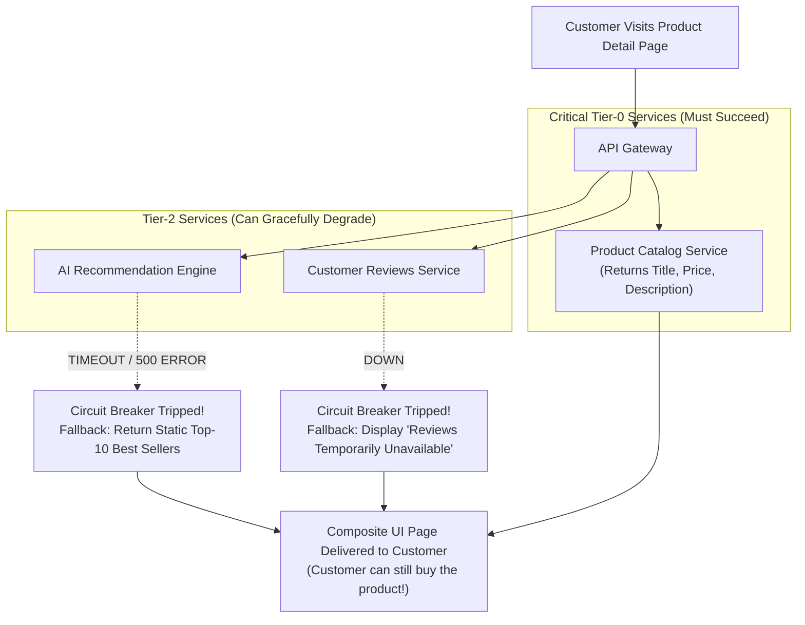

# Fault Tolerance & Graceful Degradation Architecture

## 1. Executive Summary
In complex enterprise microservice architectures, partial failures are inevitable. A robust system must not fail completely when a peripheral dependency goes down. This guide details **graceful degradation, circuit breakers, fallback caches, and bulkhead isolation**.

---

## 2. Graceful Degradation in Action (E-Commerce Example)

---

## 3. Key Resiliency Patterns

### 1. The Circuit Breaker Pattern
Monitors outbound calls for consecutive failures. When failure threshold is exceeded (e.g., 50% errors over 10s), the circuit **Opens**, immediately failing fast without burdening the struggling dependency.

### 2. Bulkhead Isolation
Isolates critical resource pools (thread pools, database connection pools, memory buffers) so that a failure in one domain cannot exhaust resources needed by others.

### 3. Fallback Caches
When a real-time data service fails, the caller falls back to stale local cache data or static defaults rather than returning an error to the end user.

---

## 4. Resiliency Verification Metrics

| Resiliency SLI | Nominal State | Degraded State Target |
| :--- | :--- | :--- |
| **Checkout Flow Availability** | $99.99\%$ | $100\%$ (Guaranteed by fallback catalog) |
| **Circuit Breaker Trip Time** | Closed (0ms delay) | Trip to Open within $< 1.5\text{ seconds}$ |
| **Blast Radius Isolation** | Single service error | Strictly confined to affected feature widget |
