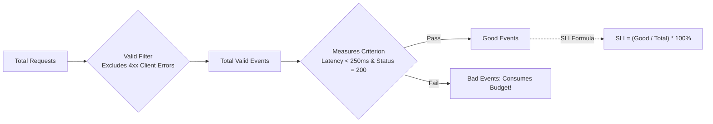
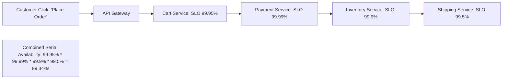

# Enterprise SLI / SLO Architectural Framework

## 1. Executive Summary
Service Level Objectives (SLOs) establish the formal boundary between nominal operational performance and unacceptable degradation. This document defines the mathematical formulation of Service Level Indicators (SLIs), the taxonomy of SLO tiers, composite user journey SLOs, and the architectural mechanics of error budget calculation.

---

## 2. Mathematical Definition of an SLI

An SLI is a quantifiable metric measuring the level of service provided to users. In the modern SRE paradigm, all SLIs are formulated as a **Ratio of Good Events to Total Valid Events**:

$$\text{SLI} = \frac{\sum \text{Good Events}}{\sum \text{Total Valid Events}} \times 100\%$$

### Why the Event-Ratio Formulation is Mandatory
1. **Mathematical Aggregation**: Event ratios can be combined cleanly across time windows (1-hour, 24-hour, 30-day) and server clusters without suffering from the **"Averaging of Averages" fallacy**.
2. **Percentile Immunity**: Using simple mean latency obscures catastrophic long-tail latency experienced by 1% of high-value enterprise users.

---

## 3. The 6 Universal SLI Categories

| Category | Typical SLI Formulation | Example Metric Expression (PromQL) | What It Measures |
| :--- | :--- | :--- | :--- |
| **Availability** | $\frac{\text{Successful HTTP Requests}}{\text{Total Valid HTTP Requests}}$ | `sum(rate(http_requests_total{status!~"5.."}[30d])) / sum(rate(http_requests_total[30d]))` | Proportion of requests returning successful non-5xx responses. |
| **Latency** | $\frac{\text{Requests with } \text{RTT} \le T_{\text{threshold}}}{\text{Total Valid Requests}}$ | `sum(rate(http_request_duration_seconds_bucket{le="0.25"}[30d])) / sum(rate(http_request_duration_seconds_count[30d]))` | Proportion of requests executing faster than the user satisfaction limit ($T_{\text{threshold}}$). |
| **Throughput** | $\frac{\text{Time intervals with } QPS \ge QPS_{\text{min}}}{\text{Total Time Intervals}}$ | `sum_over_time((rate(orders_processed_total[1m]) > 100)[30d:1m]) / (30 * 24 * 60)` | Proportion of time an event stream processes expected volume without starvation. |
| **Correctness** | $\frac{\text{Transactions with zero data drift}}{\text{Total Reconciled Transactions}}$ | `sum(ledger_transactions_balanced_total) / sum(ledger_transactions_total)` | Proportion of records processed without silent business corruption. |
| **Freshness** | $\frac{\text{Data records processed within } \Delta t_{\text{max}}}{\text{Total Data Records Processed}}$ | `sum(kafka_consumer_records_lag_seconds < 60) / sum(kafka_consumer_records_total)` | Proportion of stream/batch records processed within freshness requirements. |
| **Durability** | $\frac{\text{Successful reads of written records}}{\text{Total write attempts confirmed}}$ | `sum(storage_objects_verified) / sum(storage_objects_persisted)` | Probability that committed data remains readable without corruption. |

---

## 4. Setting Realistic SLOs (The 9s Fallacy)

An SLO must never be set to 100%. **100% reliability is an anti-pattern**:
- Users cannot distinguish between 99.99% and 100% availability because the user's local ISP, mobile cell tower, Wi-Fi router, or browser will fail at a rate of 1% to 2%.
- The cost of adding an additional "9" increases exponentially ($10\times$ cost multiplier per additional 9).

### Enterprise SLO Tiers & Downtime Budget

| Tier | Annual Availability SLO | Monthly Downtime Allowed | Weekly Downtime Allowed | Target System Archetype |
| :--- | :--- | :--- | :--- | :--- |
| **Tier 1: Mission-Critical Core** | **99.99% (Four 9s)** | **4.38 Minutes** | **1.01 Minutes** | Core Payment Gateway, Banking Ledger, Emergency Dispatch |
| **Tier 2: Business-Critical** | **99.9% (Three 9s)** | **43.8 Minutes** | **10.1 Minutes** | E-Commerce Checkout, User Authentication (IdP), Order API |
| **Tier 3: Standard Operations** | **99.5%** | **3.65 Hours** | **50.4 Minutes** | Search Engine, Product Recommendations, Content Catalog |
| **Tier 4: Non-Critical / Batch** | **99.0% (Two 9s)** | **7.30 Hours** | **1.68 Hours** | Internal Reporting, Analytics Dashboards, Asynchronous Invoicing |

---

## 5. Composite User Journey SLOs

Modern microservice architectures decompose a single user click into 20+ backend RPC calls. Measuring individual microservice availability does not measure user happiness.

### The Composite Journey Formula
When services execute in a synchronous serial dependency chain, **total journey availability is the product of individual service availabilities**:

$$A_{\text{journey}} = \prod_{i=1}^{N} A_{\text{service}_i}$$

### Architectural Safeguard: Decouple Non-Essential Dependencies
To prevent lower-tier services (e.g., Shipping Recommendations, 99.5%) from dragging down critical transactions (Place Order, 99.99%), architects must enforce:
1. **Graceful Fallbacks**: If the recommendation service times out, return a cached or static recommendation; do not abort the checkout transaction.
2. **Asynchronous Decoupling**: Offload non-blocking actions (e.g., sending email receipts, audit telemetry) to asynchronous Kafka queues after the primary transaction commits.
