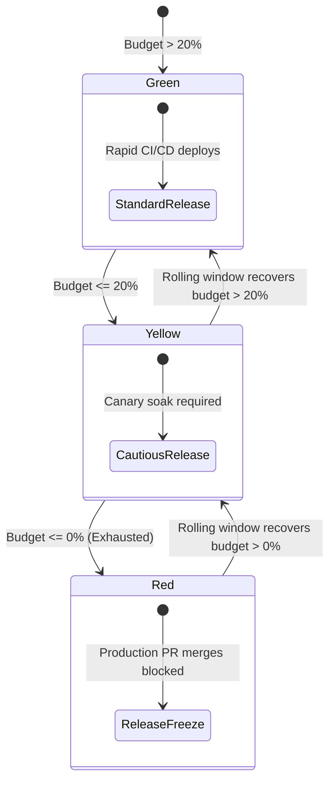

# Enterprise Error Budget Policy & Release Freeze Contract

## 1. Executive Summary
An SLO without an **Error Budget Policy** is merely a vanity dashboard. The Error Budget Policy is a binding organizational contract signed by the **VP of Product Management, Head of Engineering, and Lead SRE**.

It defines the exact, non-negotiable operational and deployment actions that automatically take effect when a service exhausts its error budget.

---

## 2. The Formal Error Budget Policy Contract

### ARTICLE 1: Principles of Agreement
1. Error budgets are a shared pool of reliability risk.
2. Product and Engineering agree that 100% reliability is neither attainable nor desirable.
3. When the error budget is positive, Product dictates feature deployment velocity.
4. When the error budget is exhausted, **Engineering dictates 100% of sprint capacity until reliability is restored**.

---

### ARTICLE 2: Operational States & Automated Gates

| Budget State | Budget Remaining | SRE & Product Actions | CI/CD Pipeline Enforcement |
| :--- | :--- | :--- | :--- |
| **GREEN** | **$> 20\%$** | Nominal feature velocity. All automated canary deployments enabled. | Continuous deployment permitted. |
| **YELLOW** | **$> 0\%$ and $\le 20\%$** | High-risk architectural refactors postponed. Canary soak duration doubled to 2 hours. | Deployments require squad lead sign-off. |
| **RED** | **$\le 0\%$ (Exhausted)** | **MANDATORY RELEASE FREEZE**. All feature development stops immediately. 100% of engineering capacity pivots to reliability debt. | **CI/CD blocks all non-security production merges**. |

---

### ARTICLE 3: Exceptions & The Break-Glass Procedure
Can a feature deployment bypass an active release freeze?
- **Only under severe commercial necessity**: The exception must be co-signed in writing by the **Chief Technology Officer (CTO)** and the **Chief Product Officer (CPO)**.
- If approved, the executive sponsors formally accept the commercial and reputational risk of a total system outage.
