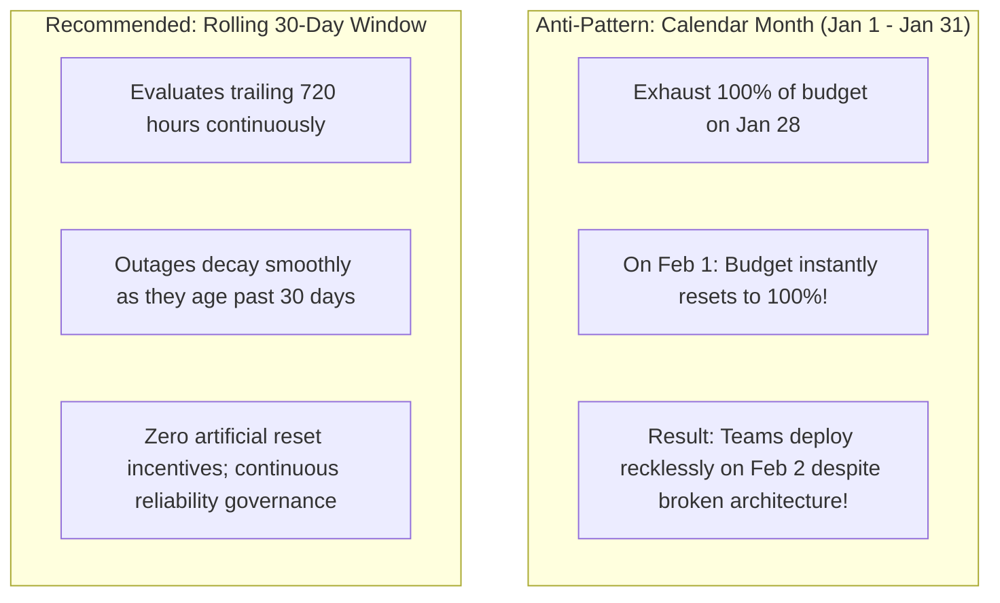

# Error Budget Mathematics & Rolling Windows

## 1. Executive Summary
The **Error Budget** is the exact mathematical inverse of the Service Level Objective:
$$\text{Error Budget} = 100\% - \text{SLO}$$

For a service with a **99.9% availability SLO**, the error budget is **0.1%**. Out of every 1,000 requests, exactly 1 request is allowed to fail without breaching the agreement.

---

## 2. Rolling Windows vs Calendar Windows



### The Architectural Rule
Enterprise SLOs must always be calculated over a **Rolling 30-Day Window (720 Hours)**. Calendar month resets create perverse engineering incentives (e.g., delaying deployments until the 1st of the month or deploying recklessly on the 2nd).

---

## 3. Calculating Budget Depletion & Burn Rate

```
Remaining Budget % = [ 1 - (Unhealthy Requests / Total Requests) / (1 - SLO) ] * 100%
```

### Numerical Scenario
- Total Monthly Traffic: 10,000,000 requests.
- SLO Target: 99.9% ($\text{Budget} = 0.001 \times 10,000,000 = 10,000 \text{ allowed errors}$).
- Outage Incident: 4,000 failed requests over a 20-minute database lock.
- **Budget Consumed**:
  $$\frac{4,000}{10,000} = 40.0\% \text{ of monthly error budget consumed in 20 minutes!}$$
- **Budget Remaining**: $60.0\%$. The team can still deploy features, but must exercise caution.
