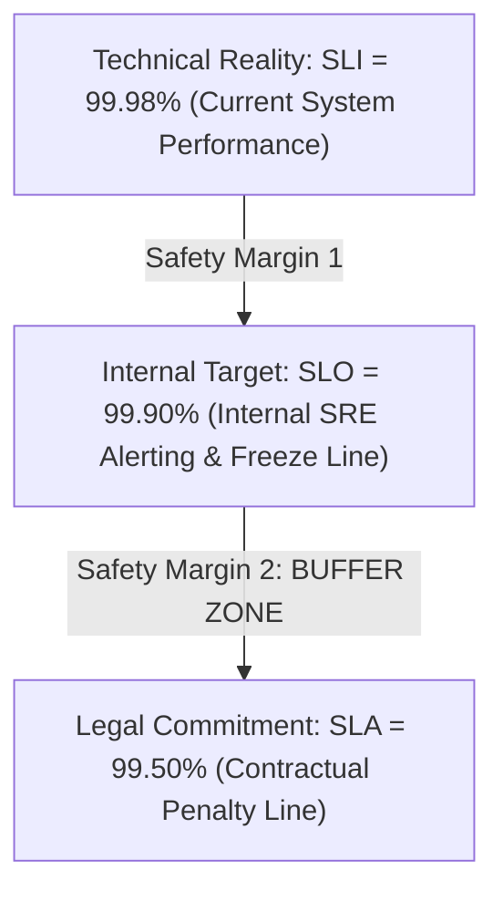

# SLA vs SLO vs SLI: Alignment, Buffers & Financial Penalties

## 1. Executive Summary
Confusing an internal **SLO** with an external legal **SLA** is a catastrophic business mistake. Breaching an internal SLO triggers a sprint redirection; breaching an external SLA triggers **financial penalties, contractual rebates, and legal breach of contract**.

Enterprise architecture mandates a strict **Buffer Hierarchy** between SLIs, SLOs, and SLAs.

---

## 2. The Buffer Hierarchy (The SRE Safety Margin)

### Why the Buffer Zone is Mandatory
- **Internal SLO (99.9%)**: Stricter than the SLA. When an outage occurs, the internal SLO fires alerts and halts deployments at 99.9%.
- **External SLA (99.5%)**: Still safely preserved! The engineering team has **$0.4\%$ of buffer room** (nearly 3 hours of additional downtime) to remediate the outage before a single customer becomes legally entitled to a financial credit.

---

## 3. Comparison Matrix

| Architectural Dimension | SLI (Service Level Indicator) | SLO (Service Level Objective) | SLA (Service Level Agreement) |
| :--- | :--- | :--- | :--- |
| **What It Is** | A specific metric measurement. | An internal engineering goal. | A legal contract with customers. |
| **Example** | `Good Requests / Total Requests = 99.93%` | `Target: 99.9% over 30 days` | `Commitment: 99.5% or 20% billing credit` |
| **Owned By** | SRE and Software Engineers | Engineering and Product Management | Legal, Finance, and Enterprise Sales |
| **Penalty for Breach** | None (It is just telemetry data). | Engineering release freeze; sprint pivot to tech debt. | **Direct financial loss, customer refunds, churn**. |
| **Audience** | Internal dashboards and alerts. | Engineering, SRE, and Product leadership. | External enterprise customers and auditors. |
