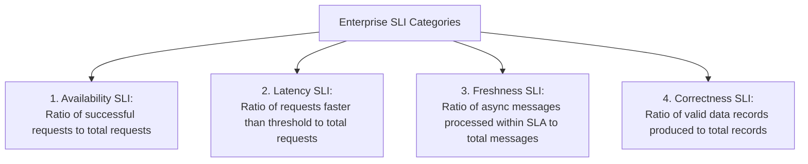

# Service Level Indicator (SLI) Design & PromQL Formulation

## 1. Executive Summary
A **Service Level Indicator (SLI)** is a carefully defined quantitative measure of some aspect of the service level provided. 

The universal SRE standard for SLIs is the **Ratio Metric**:
$$\text{SLI} = \frac{\sum \text{Good Events}}{\sum \text{Total Valid Events}} \times 100\%$$

Emitting raw percentages or moving averages directly from services is an anti-pattern because they cannot be aggregated correctly across multiple pods or varying traffic volumes.

---

## 2. The 4 Canonical SLI Types



---

## 3. Concrete SLI PromQL Implementations

### 1. Availability SLI (Request-Based)
Measures the percentage of HTTP requests that do not return a server error (5xx):
```promql
# Good requests: HTTP status not matching 5xx
# Total requests: All HTTP requests excluding client 4xx authentication rejections
sum(rate(http_requests_total{job="checkout", status!~"5.."}[30d]))
/
sum(rate(http_requests_total{job="checkout"}[30d]))
```

### 2. Latency SLI (Threshold-Based)
Measures the percentage of checkout requests completed in **less than 500 milliseconds**:
```promql
# Good requests: Requests in the <= 0.5s bucket
# Total requests: Total requests recorded in the histogram
sum(rate(http_request_duration_seconds_bucket{job="checkout", le="0.5"}[30d]))
/
sum(rate(http_request_duration_seconds_count{job="checkout"}[30d]))
```

### 3. Asynchronous Pipeline Freshness SLI
Measures the percentage of Kafka events processed within **30 seconds of publication**:
```promql
sum(rate(kafka_event_processing_latency_seconds_bucket{topic="orders", le="30"}[30d]))
/
sum(rate(kafka_event_processing_latency_seconds_count{topic="orders"}[30d]))
```
