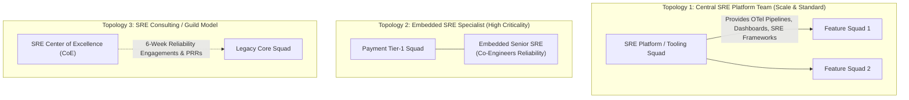

# SRE Operating Model & Organizational Architecture

## 1. Executive Summary
Site Reliability Engineering (SRE) is what happens when you treat operations as an engineering problem. This document defines the organizational topologies, service ownership contracts, on-call paging models, and toil-budget policies governing the enterprise SRE practice.

---

## 2. SRE Team Topologies

Enterprise organizations adopt one of four distinct SRE organizational topologies based on organizational scale, architectural maturity, and system criticality:



| Topology Model | Structural Alignment | Best Suited For | Key Risks & Failure Modes |
| :--- | :--- | :--- | :--- |
| **Central Platform SRE** | Centralized engineering team building shared telemetry platforms, CI/CD gates, and SLO engines. | Large enterprises with 50+ development squads requiring standardized tooling. | SREs become disconnected from domain business logic; dev squads treat SRE as "the monitoring support desk." |
| **Embedded SRE** | Senior SREs dedicated to a single high-criticality domain squad (e.g., Core Banking, Checkout). | Mission-critical Tier-1 services where downtime costs exceed $100k/minute. | Expensive; embedded SREs risk being pulled into writing product feature code instead of engineering reliability. |
| **SRE Guild / Consultancy** | Rotational SRE specialists conducting 6-to-12 week architectural uplift sprints with product squads. | Modernization initiatives and squads preparing for critical production rollouts. | Improvements degrade once the consulting SRE rotates off if team culture does not internalize SRE practices. |
| **You-Build-It-You-Run-It** | Product squads own 100% of telemetry, SLOs, on-call paging, and runbooks autonomously. | High-maturity product organizations with modern containerized microservices. | Inconsistent standards across teams; alert fatigue if product squads lack SRE training. |

---

## 3. Service Ownership & The Production Readiness Gate

A service cannot be deployed to production without an explicit, unambiguous **Service Ownership Contract**:

```
[Product Development Squad]
  - Owns feature code, unit tests, and domain logic.
  - Implements OpenTelemetry instrumentation.
  - Writes operational runbooks for all alert conditions.
  - Participates in primary Tier-1 on-call rotation.
                 │
                 ▼
[Production Readiness Review (PRR)]
  - Verifies: SLIs defined, SLOs approved, Error Budget policy enacted.
  - Verifies: Runbooks tested in staging; alerts validated via chaos injection.
  - Gatekeeper: SRE Guild / Architecture Review Board.
                 │
                 ▼
[Production Deployment & SRE Co-Operation]
```

---

## 4. The 50% Rule: Toil Management & Engineering Policy

Google SRE defines **Toil** as work that is manual, repetitive, automatable, tactical, devoid of enduring value, and scales linearly as a service grows.

$$\text{SRE Time Allocation} = \underbrace{\text{Reliability Engineering} \ge 50\%}_{\text{Software engineering, automation, chaos testing}} + \underbrace{\text{Operational Toil} \le 50\%}_{\text{On-call tickets, manual failovers, alerts}}$$

### The Toil Ceiling Enforcement Policy
1. **Toil Tracking**: All repetitive manual operational tasks must be logged as JIRA tickets under the `Toil` epic.
2. **Breach Protocol**: If a team's rolling 30-day operational toil exceeds **50% of total engineering capacity**:
   - Product feature roadmap commits are immediately **suspended by 20%**.
   - The team enters an **Operational Hardening Sprint** dedicated exclusively to automating toil (e.g., self-healing scripts, runbook automation, alert tuning).
   - Once toil drops below 35%, normal product velocity resumes.

---

## 5. On-Call Rotations & Operational Health

Sustainable on-call is an architectural prerequisite. An overwhelmed on-call team will make critical operational errors during major outages:
- **Minimum Rotation Size**: A minimum of **6 qualified engineers** is required for an on-call rotation to prevent burnout.
- **Shift Duration**: Standard rotations are **7 days on-call**, starting on Tuesday at 10:00 AM (avoiding Friday handovers).
- **Incident Quotas**: An on-call engineer must not receive more than **2 high-severity pages (SEV-1/2) per 12-hour shift**. Receiving $> 2$ pages indicates an architectural breakdown; non-critical alerts must be silenced immediately and a technical debt ticket opened.
- **Compensatory Time & Pay**: Engineers are compensated for primary on-call shifts and receive mandatory compensatory rest following off-hours incident engagements.
