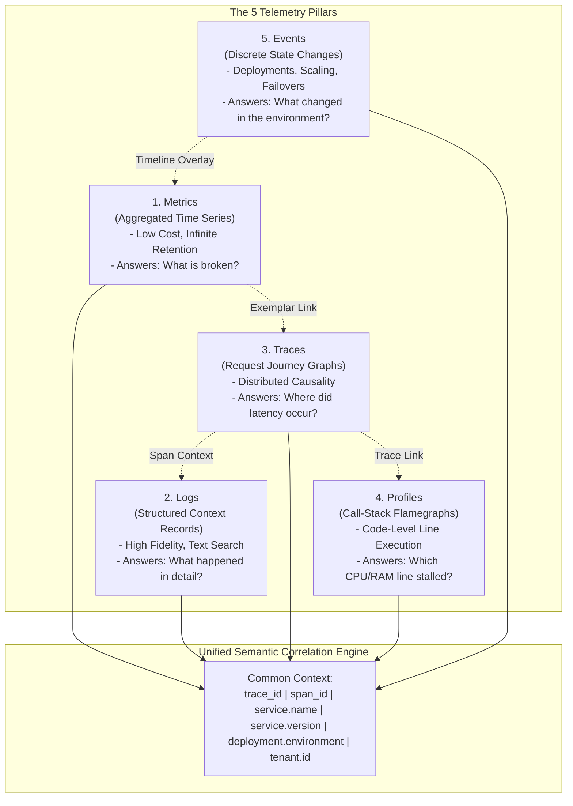

# Enterprise Telemetry Strategy: The 5 Pillars

## 1. Executive Summary
A mature observability program treats telemetry as a unified multidimensional dataset rather than disconnected logs, metrics, and traces. This strategy articulates the distinct role, data model, retention profile, and correlation mechanics for the **5 Pillars of Enterprise Telemetry**: **Metrics, Logs, Distributed Traces, Continuous Profiles, and Business Events**.

---

## 2. The 5 Pillars Telemetry Model

---

## 3. Comprehensive Pillar Comparative Matrix

| Pillar | Primary Unit | Mathematical Model | Typical Ingestion Volume | Optimal Retention Policy | Primary Architectural Use Case |
| :--- | :--- | :--- | :--- | :--- | :--- |
| **Metrics** | Time-series data points | $(t, v) \in \mathbb{R}^2$ with label set | Low to Medium ($10^4$ to $10^6$ series) | 13 Months (Downsampled to 1h after 30d) | Detecting SLO breaches, real-time alerting, dashboard visualization, and capacity trends. |
| **Logs** | Structured JSON events | Timestamped key-value maps with string messages | Extremely High ($10^7$ to $10^9$ lines/day) | Hot: 7d, Warm: 30d, Cold: 90d, Archive: 7yr (Compliance) | Forensic post-incident debugging, audit trails, error stack traces, and security monitoring. |
| **Traces** | Spans & DAG graphs | Directed Acyclic Graph of execution intervals | High (Requires intelligent tail sampling) | Full Trace: 7d; Sampled/Aggregated: 30d | Identifying distributed latency bottlenecks, dependency cycles, and multi-service errors. |
| **Profiles** | Stack-trace samples | Aggregated call trees (Pprof / Collapsed stacks) | Low to Medium (Periodic 10-100Hz sampling) | Raw: 14d; Aggregated: 90d | Pinpointing exact CPU-burning loops, memory leaks, lock contention, and off-heap allocations. |
| **Events** | Discrete metadata records | Single state-transition assertions | Very Low ($10^2$ to $10^4$ events/day) | 12 to 24 Months | Correlating deployments, config rollouts, chaos experiments, and auto-scaling with failure triggers. |

---

## 4. Universal Correlation Mechanics

Telemetry data without correlation requires manual cognitive reconstruction during an outage. Correlation must be automated across four primary axes:

### Axis 1: Trace-to-Log Correlation
- **Mechanism**: Application logging frameworks (Log4j2, Serilog, Winston, Loguru) automatically extract the active OpenTelemetry `trace_id` and `span_id` from the current thread context (MDC) and append them as top-level JSON attributes.
- **Developer Experience**: Clicking on an error log entry in the UI immediately pulls up the full distributed trace; clicking on a span immediately opens all logs emitted during that exact span's execution duration.

### Axis 2: Metric-to-Trace Correlation (Exemplars)
- **Mechanism**: OpenTelemetry SDK histograms record the `trace_id` of representative transactions within each histogram bucket (Exemplars per OpenMetrics RFC).
- **Developer Experience**: When an engineer observes a sudden spike in the P99 latency bucket on a Prometheus graph, they hover over the spike and click the exemplar dot, opening the specific transaction trace that produced the latency anomaly.

### Axis 3: Trace-to-Profile Correlation
- **Mechanism**: Continuous profilers link CPU execution traces to the active OpenTelemetry span ID when executing in supported language runtimes (Java async-profiler, Go runtime pprof).
- **Developer Experience**: Right-clicking a slow 4.2-second database transformation span opens a flamegraph filtered specifically to that span's execution window, revealing an un-indexed regex parsing loop.

### Axis 4: Event-to-Metric Timeline Correlation
- **Mechanism**: CI/CD pipelines (GitHub Actions, ArgoCD) and cloud event bridges push discrete events (e.g., `deployment_started`, `hpa_scale_up`) with service tags into the metrics engine.
- **Developer Experience**: Dashboards automatically render vertical marker lines at the exact moment a deployment or autoscaling event occurred, visually correlating code rollouts with latency regression.

---

## 5. Telemetry Ingestion Governance

To prevent telemetry systems from consuming excessive infrastructure budgets, the enterprise telemetry strategy mandates:
1. **At-Source Sanitization**: Drop raw debug payloads before network transmission in production environments.
2. **Deterministic Cardinality Ceilings**: Enforce maximum unique metric series limits ($< 10,000$ series per service instance).
3. **Dynamic Tail Sampling**: Retain 100% of errors, 100% of slow requests, and 1% of nominal 200 OK traffic.
4. **Automated Tiered Storage**: Transition logs to object storage after 7 days to slash storage TCO by up to 80%.
