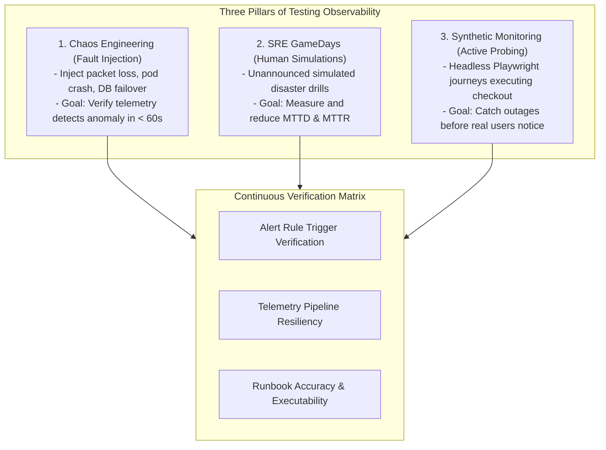

# Testing Observability, Chaos Engineering & Synthetic Monitoring

## Executive Summary

Observability systems are software systems; like any mission-critical software, **they fail unless systematically tested**. An alerting rule with a typo in its PromQL query will fail silently; a logging pipeline that drops error traces under backpressure leaves engineers blind during outages; a dashboard displaying outdated metrics delays disaster recovery.

Testing Observability encompasses three operational disciplines:
1. **Chaos Engineering**: Proactively injecting controlled failure into production and staging to verify that alerts fire on time and dashboards reflect reality.
2. **SRE GameDays**: Structured human simulations measuring Mean Time to Detect (MTTD) and Mean Time to Mitigate (MTTR).
3. **Synthetic Monitoring**: Continuous headless browser journeys testing the critical path 24/7/365, independent of real user traffic.

---

## Directory Index

| Document | Architectural Focus |
| :--- | :--- |
| **[`chaos-engineering.md`](chaos-engineering.md)** | Controlled fault injection (Chaos Mesh, LitmusChaos): verifying alert latency, metric shifts, and trace propagation under fire. |
| **[`game-days.md`](game-days.md)** | Operational disaster simulation: scenario design, blast radius containment, MTTD/MTTR scorecards, and post-drill remediation. |
| **[`observability-validation.md`](observability-validation.md)** | Pre-production telemetry verification in CI/CD: unit-testing alert rules, linting log schemas, and synthetic traffic generation. |
| **[`synthetic-monitoring.md`](synthetic-monitoring.md)** | Active blackbox probing: Playwright/Puppeteer synthetic transactions, multi-region probes, and canary user verification. |
| **[`anti-patterns.md`](anti-patterns.md)** | 12 Lethal testing anti-patterns (testing in prod only, unannounced chaos, game days without rubrics, ignoring synthetic failures). |
| **[`checklists/observability-testing-checklist.md`](checklists/observability-testing-checklist.md)** | 25-Point practical audit checklist for chaos engineering, GameDays, and synthetic monitoring readiness. |
