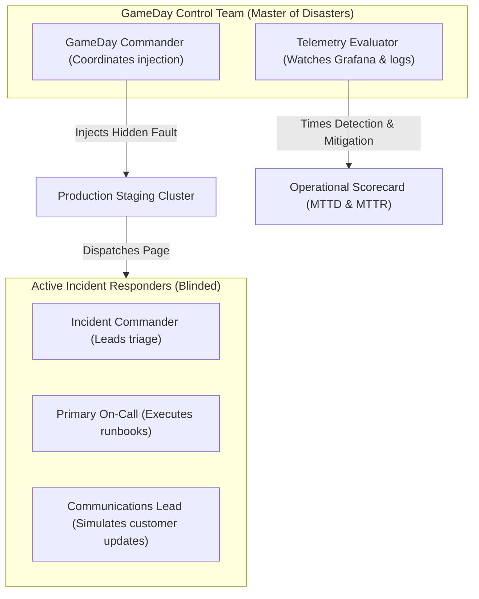

# SRE GameDays: Disaster Simulation & Operational Scorecards

## 1. Executive Summary
A **GameDay** is a scheduled exercise where engineering teams simulate catastrophic failure scenarios in staging or production. The goal is to test both **technical systems** (failovers, autoscalers, alerts) and **human sociotechnical systems** (incident response, war room communication, runbook clarity).

---

## 2. GameDay Roles & Execution Topology

---

## 3. The 4 Canonical GameDay Scenarios

| Scenario | Injected Failure | Expected System Behavior | SRE Evaluation Focus |
| :--- | :--- | :--- | :--- |
| **The Black Hole DB** | Cut all TCP egress to primary PostgreSQL cluster. | Service enters read-only fallback mode; circuit breaker trips in $< 5\text{s}$. | Does the DB cluster alert fire before the 50 downstream app alerts? |
| **The Zombie Node** | Induce 100% CPU starvation and packet drop on 1 Kubernetes node. | Kubelet marks node `NotReady`; pods evicted to healthy nodes in $< 60\text{s}$. | Do dashboards show node degradation or are pods silently failing? |
| **The Corrupted Config** | Deploy bad environment variable via CI/CD causing immediate pod panic. | Deployment rolls back automatically via canary metric analysis. | Does ArgoCD / Spinnaker catch the error before 100% rollout? |
| **The Clock Drift** | Shift system clock forward by 120 seconds on auth server. | Token validation fails; TLS handshakes reject certificates. | Do logs explicitly identify clock skew or emit generic handshake errors? |
