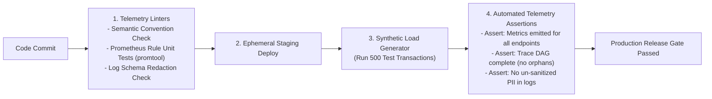

# Pre-Production Observability Validation in CI/CD

## 1. Executive Summary
Allowing code into production without validating its telemetry instrumentation is equivalent to shipping code without unit tests. An application with broken logging or missing metrics is **un-operable**.

Enterprises enforce **Observability Linting and Automated Telemetry Assertions** directly in continuous integration (CI) pipelines.

---

## 2. The Observability CI/CD Verification Pipeline



---

## 3. Automated Prometheus Rule Testing (`promtool`)

Prometheus alert and recording rules must be unit-tested using `promtool` before merging:

```yaml
# /tests/prometheus/slo_rules_test.yaml
rule_files:
  - /etc/prometheus/rules/slo_burn_rate_alerts.yaml

evaluation_interval: 1m

tests:
  # Test Case 1: Fast Burn Rate Alert Must Fire on 2% Failure Spike
  - interval: 1m
    input_series:
      - series: 'http_requests_total{job="checkout", status="500"}'
        values: '0+10x60' # 10 errors per minute for 60 minutes
      - series: 'http_requests_total{job="checkout", status="200"}'
        values: '0+100x60' # 100 successes per minute (Error rate = 9.09% >> 1.44% threshold)
    alert_rule_test:
      - eval_time: 15m
        alertname: CheckoutServiceHighErrorBudgetBurnRateFast
        exp_alerts:
          - exp_labels:
              severity: critical
              tier: tier-1
              pager: pagerduty
            exp_annotations:
              summary: "Checkout Service burning error budget at 14.4x rate (Fast Burn)"
```
