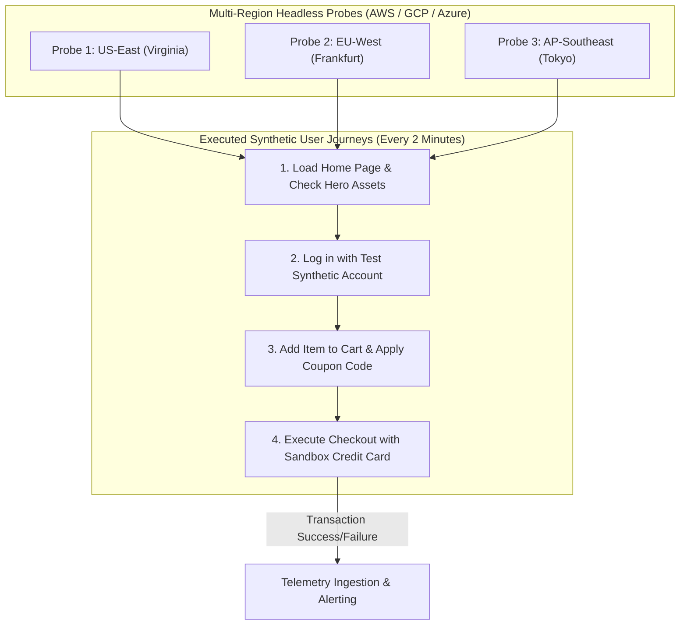

# Synthetic Monitoring: Active Probing & Headless Canary Journeys

## 1. Executive Summary
Passive monitoring (relying on real user traffic) has a fundamental flaw: **during off-peak hours (e.g., 3:00 AM), real user traffic drops to near zero**. If your authentication system or checkout page breaks at 3:00 AM, passive metric alerts will not fire because zero users are failing!

**Synthetic Monitoring** continuously runs automated, headless browser journeys that simulate real customer behavior 24/7/365 from multiple cloud regions around the globe.

---

## 2. Multi-Region Synthetic Probing Architecture



---

## 3. Production Playwright Synthetic Test Script

```javascript
// synthetics/checkout-journey.spec.js
const { test, expect } = require('@playwright/test');

test('Critical User Journey: Checkout E2E Synthetic Flow', async ({ page }) => {
  const startTime = Date.now();
  
  // Step 1: Navigate to Storefront
  await page.goto('https://shop.enterprise.com');
  await expect(page.locator('h1.brand-title')).toBeVisible();

  // Step 2: Search for Product and Add to Cart
  await page.fill('input[name="search"]', 'Enterprise Laptop Stand');
  await page.keyboard.press('Enter');
  await page.click('button.add-to-cart-btn');
  await expect(page.locator('.cart-badge')).toHaveText('1');

  // Step 3: Navigate to Checkout
  await page.goto('https://shop.enterprise.com/checkout');
  await page.fill('input[name="email"]', 'synthetic-canary@enterprise.com');
  await page.fill('input[name="cardNumber"]', '4242424242424242'); // Stripe Sandbox Test Card
  
  // Step 4: Submit Payment & Assert Confirmation
  const [response] = await Promise.all([
    page.waitForResponse(res => res.url().includes('/api/v1/orders') && res.status() === 201),
    page.click('button.submit-order-btn'),
  ]);

  const durationMs = Date.now() - startTime;
  console.log(`Synthetic Journey completed successfully in ${durationMs}ms`);
  expect(durationMs).toBeLessThan(8000); // Assert complete journey < 8 seconds
});
```
