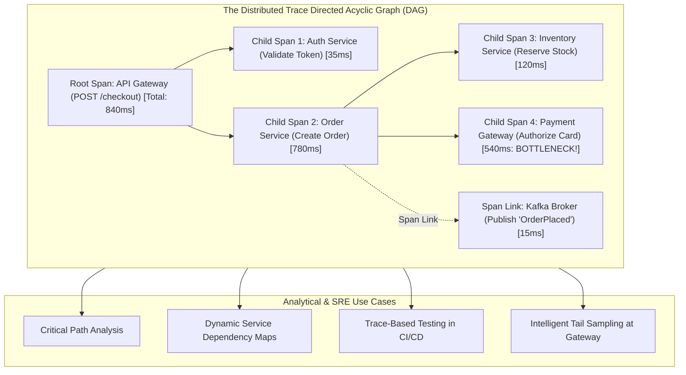

# Distributed Tracing Architecture & Analysis

## Executive Summary

Distributed Tracing is the only telemetry discipline capable of reconstructing the end-to-end causal journey of a transaction as it traverses hundreds of microservices, asynchronous message queues, serverless functions, and distributed databases.

While metrics identify that aggregate latency has increased and logs capture localized error strings, **distributed tracing reveals the exact structural bottleneck**: which downstream service delayed the response, which database query locked a table, and which network hop dropped a packet.

---

## Directory Index

| Document | Architectural Focus |
| :--- | :--- |
| **[`distributed-tracing.md`](distributed-tracing.md)** | Core data model: Traces, Spans, DAGs, Parent-Child relationships, Events, Status codes, and Span Kinds. |
| **[`trace-propagation.md`](trace-propagation.md)** | Cross-network wire formats: W3C TraceContext vs B3 vs Jaeger, baggage carriers, and protocol adapters. |
| **[`asynchronous-tracing.md`](asynchronous-tracing.md)** | Event-driven tracing across Kafka, RabbitMQ, and SQS: Span Links vs Parent-Child spans and batching. |
| **[`trace-analysis.md`](trace-analysis.md)** | Analytical methods: Critical path determination, latency decomposition, automated bottleneck detection. |
| **[`trace-based-testing.md`](trace-based-testing.md)** | Architectural governance in CI/CD: asserting dependency boundaries, N+1 query detection, and SLO compliance. |
| **[`tail-sampling-deep-dive.md`](tail-sampling-deep-dive.md)** | Tail sampling mechanics: collector routing, consistent trace hashing, memory budgeting, and economic ROI. |
| **[`anti-patterns.md`](anti-patterns.md)** | 12 Lethal tracing anti-patterns (tracing loops, context evaporation, span explosion, missing errors). |
| **[`checklists/tracing-architecture-checklist.md`](checklists/tracing-architecture-checklist.md)** | 25-Point practical audit checklist for distributed tracing architecture and production readiness. |
