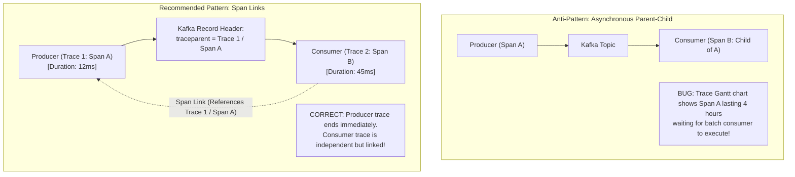
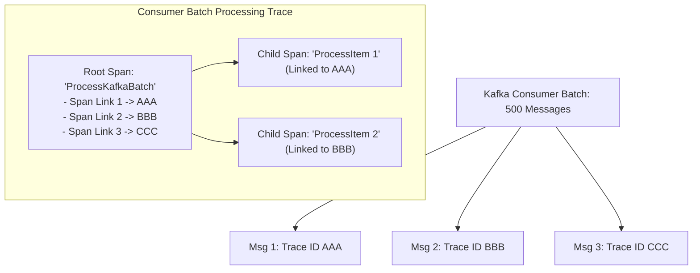

# Asynchronous & Event-Driven Tracing Architecture

## 1. Executive Summary
Tracing synchronous HTTP/gRPC call chains is straightforward: parent calls child, waits for response, and child completes. In **Asynchronous Event-Driven Architectures** (Kafka, RabbitMQ, AWS SQS), publishers decouple from consumers by seconds, hours, or days, and consumers frequently process messages in **batches**.

Modeling asynchronous event consumption as a simple parent-child relationship causes major architectural errors. This document defines the correct usage of **Span Links**, Kafka record header propagation, and batch processing tracing models.

---

## 2. Parent-Child Spans vs Span Links



### The Architectural Rule for Messaging
1. **Synchronous Messaging (RPC over MQ)**: If the producer blocks and actively awaits a reply message on a response queue, use **Parent-Child** spans.
2. **Asynchronous Fire-and-Forget / Pub-Sub**: If the producer publishes and immediately continues its execution, the consumer **must start a new Root Span and attach a Span Link** pointing back to the producer span context.

---

## 3. Tracing High-Throughput Batch Consumers

In high-throughput Kafka architectures, consumers pull batches of 500 messages at once (`poll(Duration.ofMillis(100))`). Each of the 500 messages originated from a *different* producer transaction with a different `trace_id`.



### Implementation Pattern in Java (Kafka Consumer)
```java
public void processBatch(ConsumerRecords<String, OrderEvent> records) {
    Tracer tracer = GlobalOpenTelemetry.getTracer("order-batch-consumer");
    
    for (ConsumerRecord<String, OrderEvent> record : records) {
        // 1. Extract the producer's trace context from the Kafka record headers
        Context producerContext = extractContextFromHeaders(record.headers());
        
        // 2. Start a new local span linked to the producer's trace
        Span itemSpan = tracer.spanBuilder("ProcessOrderEvent")
                              .setSpanKind(SpanKind.CONSUMER)
                              .addLink(Span.fromContext(producerContext).getSpanContext())
                              .startSpan();
                              
        try (Scope scope = itemSpan.makeCurrent()) {
            executeBusinessLogic(record.value());
            itemSpan.setStatus(StatusCode.OK);
        } catch (Exception ex) {
            itemSpan.setStatus(StatusCode.ERROR);
            itemSpan.recordException(ex);
        } finally {
            itemSpan.end();
        }
    }
}
```
