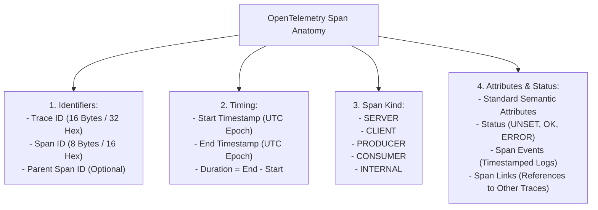

# The Distributed Tracing Data Model & Anatomy

## 1. Executive Summary
A distributed trace represents the execution path of a transaction through a distributed system. Mathematically, a trace is modeled as a **Directed Acyclic Graph (DAG)** of **Spans**, where each span represents a contiguous segment of time during which a named operation was executed.

---

## 2. Anatomy of a Span

### 1. Span Kinds & Network Boundaries
The `SpanKind` describes the relationship between the span and the network:
* **`SERVER`**: Synchronous inbound request handled by the service (e.g., handling incoming HTTP or gRPC request).
* **`CLIENT`**: Synchronous outbound request made by the service (e.g., calling an external REST API or database).
* **`PRODUCER`**: Asynchronous message published to an event broker (e.g., publishing to a Kafka topic).
* **`CONSUMER`**: Asynchronous message received and processed from an event broker.
* **`INTERNAL`**: In-process computational or domain operation not crossing any network boundary.

### 2. Span Events vs Span Attributes vs Logging
- **Attributes**: Key-value metadata describing the entire span (e.g., `http.status_code = 200`).
- **Events**: Timestamped milestones *within* the span duration (e.g., `cache_miss_occurred`, `db_connection_acquired`). Events are essentially structured log records embedded directly into the span timeline.
- **Status Codes**: Can only be `UNSET`, `OK`, or `ERROR`. If an exception occurs, the span status **must be explicitly set to `ERROR`**; simply recording the exception does not mark the span as failed in backend trace queries.

---

## 3. The Root Span Invariant

Every distributed trace has exactly **one Root Span** (a span with no `parent_span_id`).
- The Root Span is created by the very first service that handles the transaction (typically the Edge API Gateway or Ingress Controller).
- The duration of the Root Span defines the **End-to-End User Latency** of the transaction.
- If an intermediate service fails to propagate context, the downstream service creates a new Root Span with a new `trace_id`, fragmenting a single transaction into multiple disjointed "orphan" traces.
