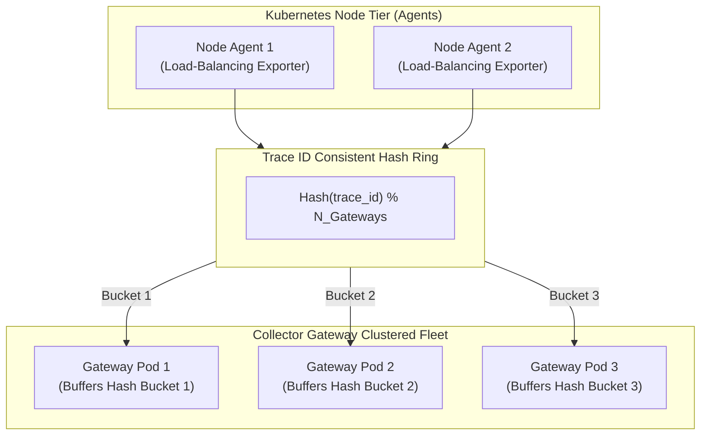

# Tail Sampling: Architecture, Routing & Memory Management

## 1. Executive Summary
Tail sampling makes the decision to sample or drop a trace **after the entire trace has finished executing**. This allows the observability platform to retain 100% of valuable traces (errors, high-latency anomalies, specific customer tenants) while discarding 95% of redundant, successful, fast traces.

This document deep-dives into the routing mechanics, memory budgeting, and fail-safe architectures required to operate tail sampling at enterprise scale.

---

## 2. Clustered Consistent Hashing Architecture

To evaluate an entire trace, all spans sharing the same `trace_id` must arrive at the same Collector gateway instance.



---

## 3. Tail Sampling Buffer Sizing & Memory Limits

A tail sampling collector buffers spans in memory for a configurable time window (`decision_wait`, typically 10 to 30 seconds) to wait for all asynchronous spans of the trace to arrive.

### The Memory Sizing Formula
$$M_{\text{collector}} = \left( R_{\text{spans}} \times S_{\text{avg}} \times T_{\text{wait}} \right) \times 1.5$$
Where:
* $R_{\text{spans}}$ = Ingestion rate in spans per second (e.g., 20,000 spans/sec).
* $S_{\text{avg}}$ = Average size of a serialized span with attributes in memory (~1.5 KB).
* $T_{\text{wait}}$ = Decision wait window (e.g., 15 seconds).
* $1.5$ = Safety multiplier for Go garbage collection overhead.

$$M_{\text{collector}} = 20,000 \times 1,500 \times 15 \times 1.5 = 675,000,000 \text{ Bytes} \approx 675 \text{ MB}$$
Across a 3-replica gateway fleet, each pod requires only ~225 MB of active buffer memory.

---

## 4. Production Tail Sampling Policy Hierarchy

The order of evaluation in the tail sampling processor is critical:

```yaml
processors:
  tail_sampling:
    decision_wait: 15s
    num_traces: 50000
    expected_new_traces_per_sec: 2500
    policies:
      # Rule 1: Always retain 100% of errors (Priority 1)
      - name: retain-errors
        type: status_code
        status_code: { status_codes: [ ERROR ] }

      # Rule 2: Always retain 100% of traces exceeding SLO latency (> 1500ms)
      - name: retain-slow-traces
        type: latency
        latency: { threshold_ms: 1500 }

      # Rule 3: Always retain 100% of VIP Enterprise Tenants
      - name: retain-vip-tenants
        type: string_attribute
        string_attribute:
          key: tenant.tier
          values: [ "enterprise", "vip" ]

      # Rule 4: Sample remaining nominal successful traffic at 2%
      - name: sample-nominal-traffic
        type: probabilistic
        probabilistic: { sampling_percentage: 2.0 }
```
