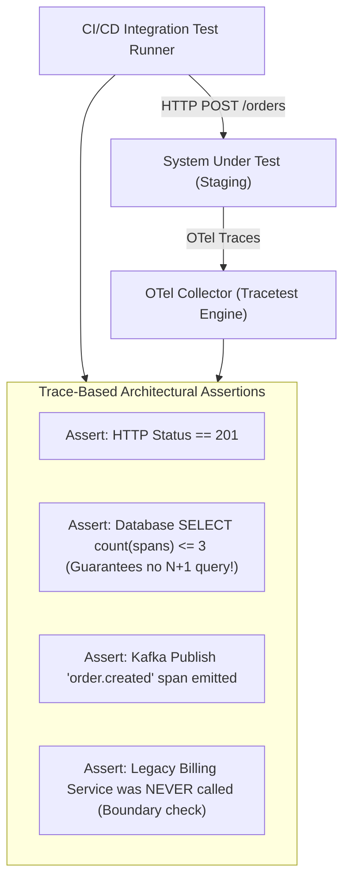

# Trace-Based Testing & CI/CD Architectural Verification

## 1. Executive Summary
**Trace-Based Testing** (promoted by tools like Tracetest and Malabi) uses OpenTelemetry traces emitted during integration tests as executable assertions. Instead of only asserting that an HTTP response returns `200 OK`, trace-based testing asserts on the **underlying architectural behavior**: Did it call the database? Did it trigger an async event? Did it execute an N+1 query? Did it violate security boundaries?

---

## 2. The Trace-Based Testing Concept



---

## 3. Example Trace-Based Test Definition (YAML)

```yaml
# test-checkout-architecture.yaml
type: Test
spec:
  id: checkout-service-architectural-contract
  name: "Checkout Architectural Integrity Verification"
  trigger:
    type: http
    httpRequest:
      url: http://staging.enterprise.com/api/v1/checkout
      method: POST
      body: '{"cart_id": "c-9182", "payment_method": "credit_card"}'

  specs:
    # Assertion 1: Basic Functional Contract
    - selector: span[name = "POST /api/v1/checkout"]
      assertions:
        - attr:http.status_code = 201
        - attr:tracetest.span.duration < 1500ms

    # Assertion 2: Architectural Contract (Eliminate N+1 Database Queries!)
    - selector: span[db.system = "postgresql" && db.operation = "SELECT"]
      assertions:
        - count() <= 2 # Fail CI build if ORM starts executing 50 queries!

    # Assertion 3: Event-Driven Decoupling Contract
    - selector: span[messaging.system = "kafka" && messaging.destination.name = "orders.placed"]
      assertions:
        - count() = 1 # Must emit exactly one event to Kafka broker

    # Assertion 4: Security Boundary Contract
    - selector: span[net.peer.name = "legacy-mainframe.internal"]
      assertions:
        - count() = 0 # Prohibit direct calls to legacy systems from modern checkout!
```
