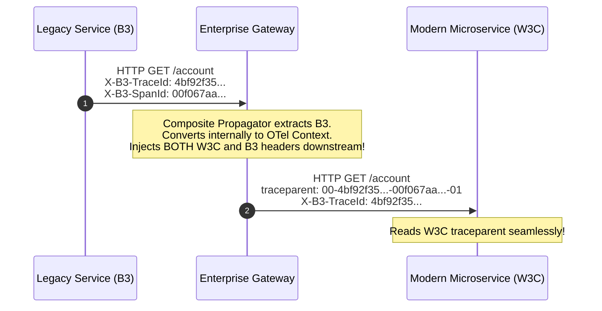

# Distributed Trace Propagation & Protocol Conversion

## 1. Executive Summary
Context propagation formats have evolved across generations of distributed tracing systems. Modern enterprises frequently operate hybrid environments where legacy microservices use **Zipkin B3** or **Jaeger Native** headers, while modern services use the **W3C TraceContext** standard.

This document establishes the architecture for wire-level context propagation, carrier injection/extraction, and protocol bridging.

---

## 2. Comparison of Wire Formats

| Format | Origin | Ingress Headers | Encoding | Standard Status |
| :--- | :--- | :--- | :--- | :--- |
| **W3C TraceContext** | W3C / OpenTelemetry | `traceparent`<br>`tracestate` | Hexadecimal (32-char trace, 16-char span) | **Mandatory Enterprise Standard** |
| **B3 Propagation** | Zipkin | Single: `b3`<br>Multiple: `X-B3-TraceId`, `X-B3-SpanId`, `X-B3-Sampled` | Hexadecimal | Legacy (Supported via Bridge) |
| **Jaeger Native** | Uber Jaeger | `uber-trace-id` | Colon-delimited hex string | Deprecated |
| **AWS X-Ray** | AWS | `X-Amzn-Trace-Id` | Self-describing key-value string | Supported in AWS Lambda/ALB |

---

## 3. Multi-Format Composite Propagators

To prevent context drops when migrating from legacy systems to OpenTelemetry, enterprise SDK configurations must register a **Composite Propagator**:



### Enterprise Java Configuration (Spring Boot)
```yaml
# application.yaml
otel:
  propagators: "tracecontext,baggage,b3,b3multi"
```
This configuration configures the OpenTelemetry SDK to read incoming context from either W3C or B3, ensuring 100% backward compatibility during multi-year enterprise modernization programs.
