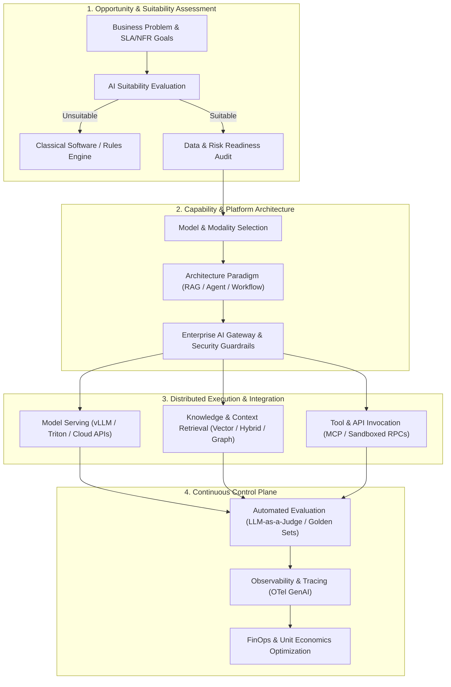

# Artificial Intelligence & Modern Architecture (`12-ai/`)

## Executive Summary

The `12-ai/` domain establishes the definitive enterprise architectural reference for designing, building, evaluating, securing, and operating Artificial Intelligence (AI) and Machine Learning (ML) systems at global scale.

A foundational architectural law governs this reference: **AI is an architectural capability, not automatically the architecture.** 

Enterprise systems should never adopt Large Language Models (LLMs) because they are popular, deploy Retrieval-Augmented Generation (RAG) because every application demands it, spawn autonomous agents because they appear modern, or mandate GPU clusters without rigorous economic justification. The architect's premier obligation is to answer:
> **Does AI actually improve the business outcome enough to justify its non-determinism, latency, token costs, security vulnerabilities, and operational burden compared to deterministic software, rules engines, or classical statistical heuristics?**

---

## Domain Taxonomy & Subdirectories

| Directory | Scope | Core Architectural Focus |
| :--- | :--- | :--- |
| [`ai-systems-architecture/`](ai-systems-architecture/) | Systems & Platforms | **Explicit Major Capability**: 24 architectural specifications covering gateways, control planes, multi-model platforms, and agent runtimes |
| [`ai-architecture/`](ai-architecture/) | Architectural Foundations | System boundaries, workloads taxonomy, predictive vs generative vs agentic, evolution paradigms |
| [`ai-fundamentals/`](ai-fundamentals/) | Fundamentals | Deterministic vs probabilistic computing, mathematical intuitions, tokenomics, entropy |
| [`ml-architecture/`](ml-architecture/) | Traditional ML | Training/inference pipelines, feature stores, data/concept drift, batch vs real-time scoring |
| [`generative-ai/`](generative-ai/) | Generative AI | Foundation models, multimodal synthesis, structured outputs, function calling primitives |
| [`llm/`](llm/) | Large Language Models | Transformer architecture, attention, pretraining, fine-tuning, RLHF/DPO, reasoning models |
| [`llm-applications/`](llm-applications/) | LLM Applications | State machines, streaming architectures (SSE/WebSockets), latency mitigation |
| [`model-selection/`](model-selection/) | Model Selection | Decision matrices across parameter size, accuracy, latency, licensing, hosting models |
| [`prompt-engineering/`](prompt-engineering/) | Prompt Architecture | Prompts as production code, versioning, few-shot structures, prompt CI/CD gates |
| [`context-engineering/`](context-engineering/) | Context Architecture | Context compression, retrieval windows, needle-in-a-haystack attention dynamics |
| [`rag/`](rag/) | Retrieval-Augmented Gen | Chunking strategies, multi-tenancy, metadata filtering, RAG variants (GraphRAG, Hybrid, Agentic) |
| [`embeddings/`](embeddings/) | Embeddings | Vector spaces, distance metrics, embedding model drift and re-indexing mechanics |
| [`vector-databases/`](vector-databases/) | Vector Storage | Specialized vector DBs vs relational vector extensions (pgvector) vs enterprise search |
| [`semantic-search/`](semantic-search/) | Semantic Search | Dense retrieval, bi-encoder architectures, semantic indexing pipelines |
| [`hybrid-search/`](hybrid-search/) | Hybrid Search | Combining BM25 keyword search with dense vectors via Reciprocal Rank Fusion (RRF) |
| [`reranking/`](reranking/) | Reranking | Cross-encoder rerankers, precision maximization, two-stage retrieval architectures |
| [`knowledge-architecture/`](knowledge-architecture/) | Knowledge Architecture | Taxonomies, ontologies, source authority, data freshness, knowledge graphs |
| [`agents/`](agents/) | Autonomous Agents | ReAct loops, planning, reasoning, observation, goal management, termination criteria |
| [`agentic-workflows/`](agentic-workflows/) | Agentic Workflows | State machines, human-in-the-loop approvals, long-running workflow persistence |
| [`tool-calling/`](tool-calling/) | Tool Invocation | Schema contracts, sandbox isolation, idempotency, Model Context Protocol (MCP) |
| [`multi-agent/`](multi-agent/) | Multi-Agent Systems | Supervisor, hierarchical, and peer agent topologies; coordination overhead trade-offs |
| [`ai-orchestration/`](ai-orchestration/) | AI Orchestration | Orchestration frameworks, state graphs, retry policies, compensation transactions |
| [`ai-memory/`](ai-memory/) | AI Memory | Short-term, long-term episodic, semantic user memory, memory poisoning, GDPR erasure |
| [`model-routing/`](model-routing/) | Model Routing | Dynamic routing by task complexity, latency budgets, cost optimization, fallback cascades |
| [`model-gateway`](ai-systems-architecture/model-gateway.md) | Model Gateway | Centralized proxy, rate limiting, quota governance, provider abstraction, unified SDKs |
| [`model-serving/`](model-serving/) | Model Serving | High-throughput serving engines (vLLM, TensorRT-LLM, Triton), continuous batching, KV caching |
| [`inference/`](inference/) | Inference Architecture | Quantization (AWQ, GPTQ, FP8), speculative decoding, latency vs throughput trade-offs |
| [`gpu-infrastructure/`](gpu-infrastructure/) | GPU Infrastructure | VRAM sizing calculations, interconnects (NVLink, InfiniBand), multi-GPU tensor parallelism |
| [`ai-platform-engineering`](ai-systems-architecture/ai-platform-architecture.md) | AI Platform Eng | Golden paths, self-service developer portals, internal AI model hubs |
| [`ai-security/`](ai-security/) | AI Security | OWASP Top 10 for LLMs, direct/indirect prompt injection, jailbreaks, data exfiltration |
| [`ai-privacy/`](ai-privacy/) | AI Privacy | PII anonymization/redaction, differential privacy, tenant data leakage isolation |
| [`ai-governance/`](ai-governance/) | AI Governance | EU AI Act risk tiers, model registries, auditability trails, ethical guardrails |
| [`ai-safety/`](ai-safety/) | AI Safety | Hallucination mitigation, automated guardrails (NeMo, Llama Guard), circuit breakers |
| [`ai-evaluation/`](ai-evaluation/) | AI Evaluation | Golden datasets, LLM-as-a-Judge, RAG triad (Faithfulness, Relevance, Groundedness) |
| [`ai-observability/`](ai-observability/) | AI Observability | OpenTelemetry GenAI semantic conventions, token telemetry, latency tracing, eval drift |
| [`ai-cost/`](ai-cost/) | Cost Optimization | Token unit economics, caching ROI, batch pricing, cost-per-user attribution |
| [`enterprise-ai/`](enterprise-ai/) | Enterprise Adoption | Operating models, AI Centers of Excellence, integration with ERP/CRM platforms |
| [`ai-integration/`](ai-integration/) | Integration Architecture | REST, gRPC, and Kafka event streaming integration with enterprise systems |
| [`ai-modernization/`](ai-modernization/) | Legacy Modernization | AI-assisted code migration, COBOL/Java refactoring, synthetic test generation |
| [`ai-patterns/`](ai-patterns/) | Architecture Patterns | 15 Production-grade AI design patterns with formal 11-section specifications |
| [`ai-anti-patterns/`](ai-anti-patterns/) | Anti-Patterns | 22 Lethal AI anti-patterns with architectural symptoms, root causes, and remedies |
| [`decision-frameworks/`](decision-frameworks/) | Decision Frameworks | 18 Formal decision scorecards for AI architectural trade-offs |
