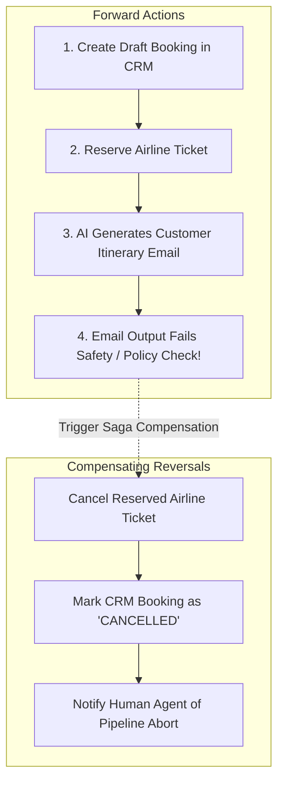

# Failure Recovery & Compensation Patterns in AI Pipelines

## 1. The Saga Pattern for AI Workflows

Because AI outputs can fail validation halfway through a multi-step sequence, systems must implement the **Saga Pattern**: every forward action must have an associated **Compensating Transaction** to roll back partial changes.

---

## 2. Invariant: Idempotency of Compensations
All compensating actions must be strictly idempotent. If the compensation worker retries canceling the ticket due to a network timeout, the downstream airline API must return HTTP 200 without throwing duplicate cancellation errors.
