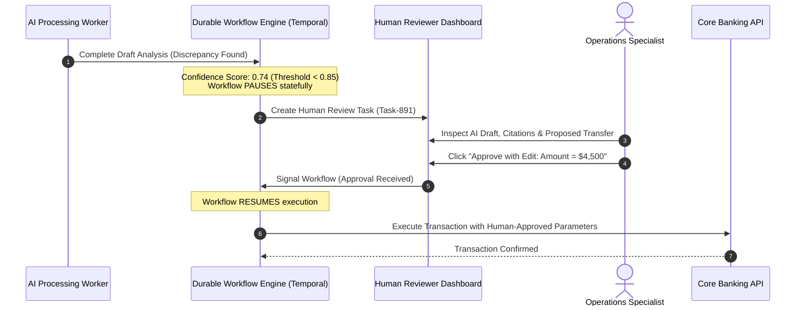

# Human-in-the-Loop (HITL) Architecture

## 1. Asynchronous Human Approval Gates

AI systems must never execute high-risk state mutations (financial transfers, record deletions, contract dispatches) without explicit human verification.

**Human-in-the-Loop Architecture** decouples automated AI drafting from human review using asynchronous pause-and-resume workflows.

---

## 2. Escalation Invariants
* **Confidence-Based Routing**:
  * $\text{Confidence} \ge 0.95$: Automatic execution (Straight-Through Processing).
  * $0.80 \le \text{Confidence} < 0.95$: Async human peer review queue.
  * $\text{Confidence} < 0.80$: Route to senior operations escalation.
* **Durable Timeouts**: If a human reviewer does not respond within 24 hours, escalate to a secondary reviewer or gracefully abort.
