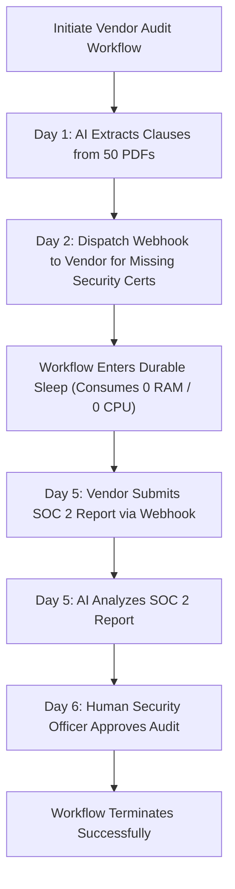

# Long-Running Agentic Workflows Architecture

## 1. Managing Workflows that Span Days or Weeks

Enterprise tasks—such as a multi-stage vendor compliance audit—involve AI processing, human reviews, external partner webhooks, and asynchronous batch evaluations spanning days or weeks.

---

## 2. Architectural Technology Selection
* **Do NOT use**: Python `time.sleep()`, long-held HTTP connections, or in-memory Celery task queues for long-running workflows.
* **Use**: **Temporal, Cadence, or AWS Step Functions**. State is recorded as an append-only event history; worker instances can be restarted, patched, or rescheduled without losing workflow state.
