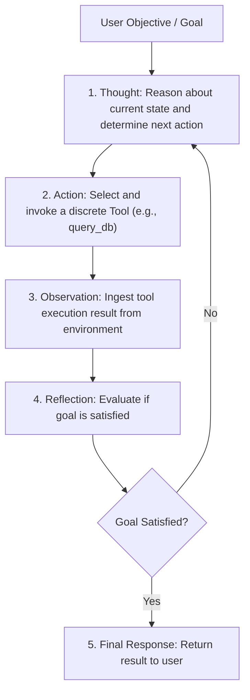

# Agent Foundations & The ReAct (Reason + Act) Loop

## 1. The ReAct Architecture

The foundational design pattern for autonomous agents is **ReAct (Reason + Act)**. Instead of generating a monolithic plan upfront, the agent interleaves reasoning thoughts with discrete tool actions and environmental observations:

---

## 2. The Agentic State Loop Invariant
At each step $t$, the agent receives:
$$\text{Prompt}_t = \text{System Prompt} + \text{Goal} + \sum_{i=1}^{t-1} (\text{Thought}_i + \text{Action}_i + \text{Observation}_i)$$
* **The Token Explosion Risk**: Because every tool observation is appended to the conversation history, agent contexts expand rapidly. The agent platform must aggressively truncate or summarize past observations after 5 iterations to avoid context exhaustion.
